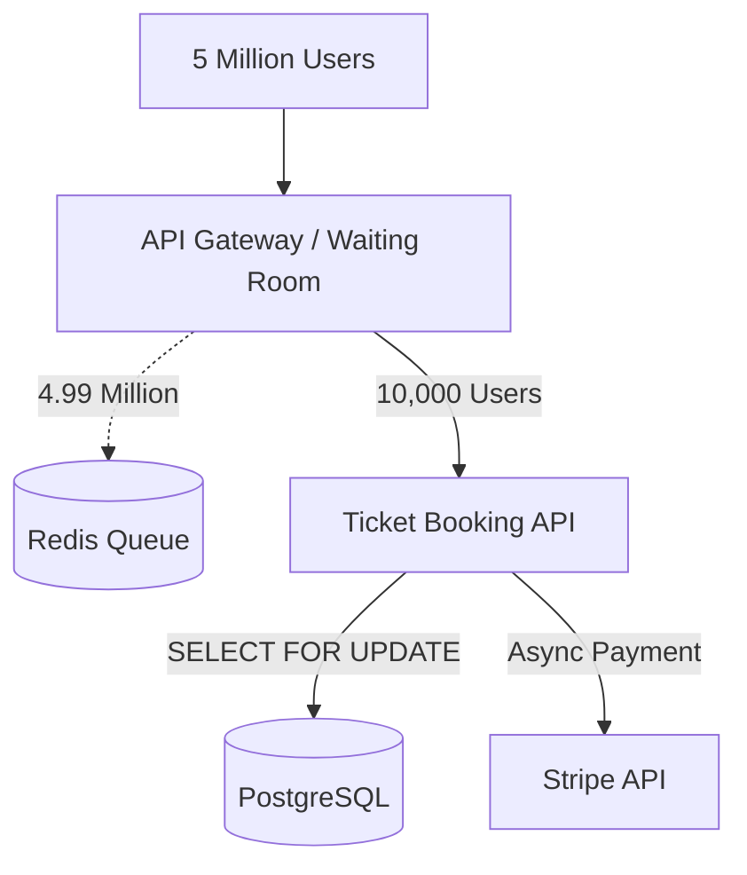

## Concept

**The Problem:** Design a system to sell concert tickets. A popular artist announces a tour, and 5 million people try to buy 50,000 specific seats at the exact same millisecond. 

This is the ultimate test of **Concurrency, Distributed Locking, and ACID Transactions**. You cannot sell the same seat to two different people.

## 1. The Core Challenge: The Double Booking Problem

If User A and User B both click "Buy Seat 5A" at the exact same time, both web servers will query the database `SELECT status FROM seats WHERE id = 5A`. Both will receive `status: AVAILABLE`. Both will execute `UPDATE seats SET status = SOLD, user = A/B`. The last one to execute overwrites the first one. Two people show up to the concert with a ticket for the same seat.

### The Solution: Pessimistic Locking
We must leverage the strict ACID properties of a Relational Database (PostgreSQL / MySQL). NoSQL databases (like Cassandra) are generally eventual consistency and are a terrible choice for financial inventory.

When a user selects a seat, we use the SQL `SELECT ... FOR UPDATE` command.
This places a strict, physical lock on that specific row in the database. When User A executes this, the database locks the row. When User B's server tries to read the row a millisecond later, the database explicitly blocks User B's query, forcing it to wait until User A finishes their transaction (or the lock times out). 

## 2. The Waiting Room (Queueing)

Even with pessimistic locking, if 5 million people hit PostgreSQL simultaneously, the database will run out of connections and crash.
We must protect the database using a **Virtual Waiting Room**.

1. **The Edge:** When the sale opens, all 5 million requests hit a massive Load Balancer (or Cloudflare).
2. **The Token:** The Load Balancer issues a unique, cryptographically signed JWT token to the user and assigns them a place in line (saved in Redis).
3. **The Valve:** The system acts as a valve. It only allows 10,000 users at a time to actually proceed to the seat-selection UI. The other 4.99 million users see a "You are in line" screen that polls the server every 30 seconds.
4. **The Protection:** Because the valve limits traffic, the PostgreSQL database only ever handles 10,000 concurrent users, operating effortlessly within its limits.

## 3. High-Level Architecture

## 4. The 5-Minute Reservation Window

Buying a ticket requires entering credit card info, which takes time. We cannot hold a database lock for 5 minutes; it ruins performance.

**The Two-Step Flow:**
1. User clicks a seat. We execute a fast transaction: `UPDATE seats SET status = RESERVED, reserved_at = NOW() WHERE id = 5A AND status = AVAILABLE`. We do not lock the row anymore.
2. The UI gives the user a 5-minute countdown timer to enter their credit card.
3. If they pay, we `UPDATE seats SET status = SOLD`.
4. **The Cron Job:** What if the user closes their browser and never pays? A background worker runs every minute: `UPDATE seats SET status = AVAILABLE WHERE status = RESERVED AND reserved_at < NOW() - 5 MINUTES`. This throws abandoned seats back into the pool.

## Interview Questions

**Q: A user completes the payment on Stripe, but a network glitch causes the HTTP response to drop. Your server never gets the confirmation, so the background cron job marks the seat as AVAILABLE, and someone else buys it. The first user was charged $100 but has no ticket. How do you fix this?**
**A:** This is a classic distributed transaction failure. You must decouple the payment from the booking confirmation using a **Two-Phase Commit / Saga Pattern**, or rely on Webhooks.
Instead of waiting synchronously for Stripe to reply, your server marks the seat as `PENDING_CONFIRMATION` and returns a "Processing" screen to the user. Stripe will eventually hit your highly-reliable Webhook endpoint. Only when the Webhook is received do you finalize the seat as `SOLD`. If the Webhook says the payment failed, you release the seat. You must also implement reconciliation jobs that cross-reference your database against Stripe's API at the end of the day to catch edge cases.

**Q: Why is Redis a bad primary database for the actual seat reservations?**
**A:** While Redis is incredibly fast and supports Lua scripts for atomic operations, it stores data in RAM. If the Redis server crashes and reboots during the peak of the sale, you could lose thousands of reservations in the split-second before it synced to disk. For financial transactions and hard inventory limits, durability (the 'D' in ACID) is paramount. You must use a traditional relational database (PostgreSQL) where writes are guaranteed to be saved to the physical hard drive via the Write-Ahead Log (WAL) before confirming success to the user.
