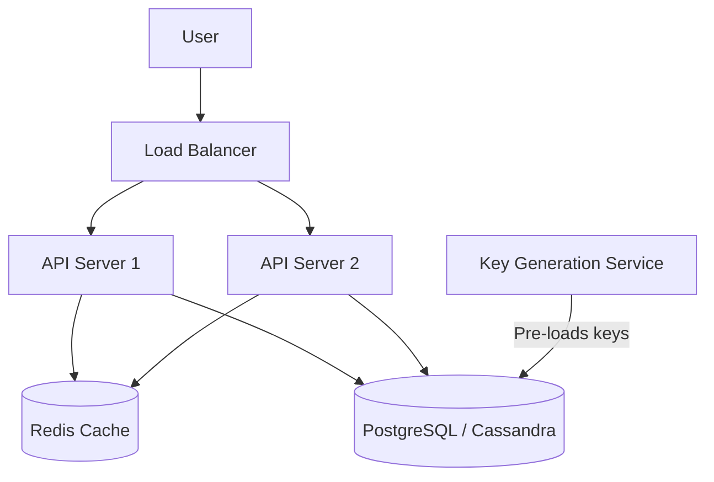

## Concept

**The Problem:** Design a service like bit.ly that takes a long URL (e.g., `https://amazon.com/product/12345/ref=abc`) and generates a short URL (e.g., `https://tiny.url/x7Yz9`). When a user visits the short URL, redirect them to the original long URL.

This is the quintessential System Design interview question. It tests your basic understanding of Databases, Hashing, and API Design.

## 1. Requirements & Estimation

**Functional:**
- Given a Long URL, return a Short URL.
- Given a Short URL, redirect to the Long URL.
- Custom short links (optional).

**Non-Functional:**
- Highly Available (If it goes down, millions of links across the internet break).
- Read-Heavy (100:1 Read-to-Write ratio).
- Low Latency for redirection.

**Estimations (The Math):**
- **Traffic:** 100 million new URLs generated per month (Writes). 10 billion clicks per month (Reads).
- **Storage:** 100M URLs * 12 months * 10 years = 12 Billion records.
- **Data Size:** If one row is 500 Bytes, 12 Billion * 500B = 6 Terabytes of database storage required.

## 2. API Design

RESTful endpoints:
- **POST** `/api/v1/data/shorten`
  - Body: `{"longUrl": "https://...", "customAlias": "my-link"}`
  - Returns: `{"shortUrl": "https://tiny.url/x7Yz9"}`
- **GET** `/{shortCode}` (HTTP 301 Redirect)
  - Returns: HTTP Header `Location: https://...`

## 3. The Core Logic: How to generate the Short Code?

We need a 7-character string. We will use Base62 encoding (a-z, A-Z, 0-9). A 7-character Base62 string allows for $62^7 = 3.5$ Trillion unique URLs, which easily covers our 12 Billion requirement.

**Approach 1: Hashing (MD5)**
Hash the Long URL using MD5, which produces a 128-bit string. Take the first 7 characters.
*Flaw:* Collisions! Two different Long URLs might hash to the exact same first 7 characters, overwriting data.

**Approach 2: Base62 Conversion of an Auto-Incrementing ID (The Winner)**
Use a global integer counter.
- User 1 arrives. Counter = `1000`. Convert integer `1000` to Base62 -> `g8`. URL is `tiny.url/g8`.
- User 2 arrives. Counter = `1001`. Convert integer `1001` to Base62 -> `g9`. URL is `tiny.url/g9`.
*Flaw:* In a distributed system, you can't have a single MySQL database generating auto-incrementing IDs without it becoming a massive bottleneck.

**The Distributed ID Generator (Key Generation Service):**
Instead of calculating on the fly, build a standalone **Key Generation Service (KGS)**. 
The KGS runs in the background, continuously generating random 7-character Base62 strings and saving them into a database table. When a user requests a new URL, the API server simply pops an unused string from the KGS database and assigns it. This completely eliminates collisions and scales infinitely.

## 4. High-Level Architecture

## 5. Scaling and Trade-Offs

**The Database:**
Since the data is highly relational (User -> URLs) and only 6TB, a sharded **PostgreSQL** database is perfectly fine. However, since there are zero complex `JOIN`s, a NoSQL database like **Cassandra** or **DynamoDB** is an excellent choice for infinite horizontal read scaling.

**The Cache (Critical):**
Reads outnumber writes 100 to 1. Querying the database 10,000 times a second for viral URLs will crash it.
You MUST introduce a **Redis Cache**. When a user visits `tiny.url/x7Yz9`, the API checks Redis first. If it's a Cache Miss, it queries the DB, saves the Long URL to Redis, and redirects. Use an **LRU (Least Recently Used)** eviction policy, caching the top 20% most popular URLs.

## Interview Questions

**Q: Should the API server return an HTTP 301 or HTTP 302 redirect code when a user clicks the short link?**
**A:** It depends on your analytics requirements.
- **HTTP 301 (Permanent Redirect):** The browser aggressively caches this. The *first* time the user clicks the link, the browser hits your server. The *second* time, the browser redirects locally without ever contacting your server. This drastically reduces your server load, but you lose the ability to track analytics (click counts) accurately.
- **HTTP 302 (Temporary Redirect):** The browser does not cache it. Every single click hits your server. This increases server load but guarantees 100% accurate click analytics.

**Q: A malicious user writes a bot that submits 100,000 fake Long URLs per second to exhaust your Key Generation Service. How do you mitigate this?**
**A:** 1. **Rate Limiting:** Implement strict IP-based Rate Limiting (e.g., 10 URLs per minute per IP) at the API Gateway. 2. **Authentication:** Require an API Key or user account to generate URLs. 3. **Recycling:** Run a background cron job that scans for Short URLs that haven't been clicked in 5 years, deletes them, and throws the 7-character key back into the KGS pool to be reused.
