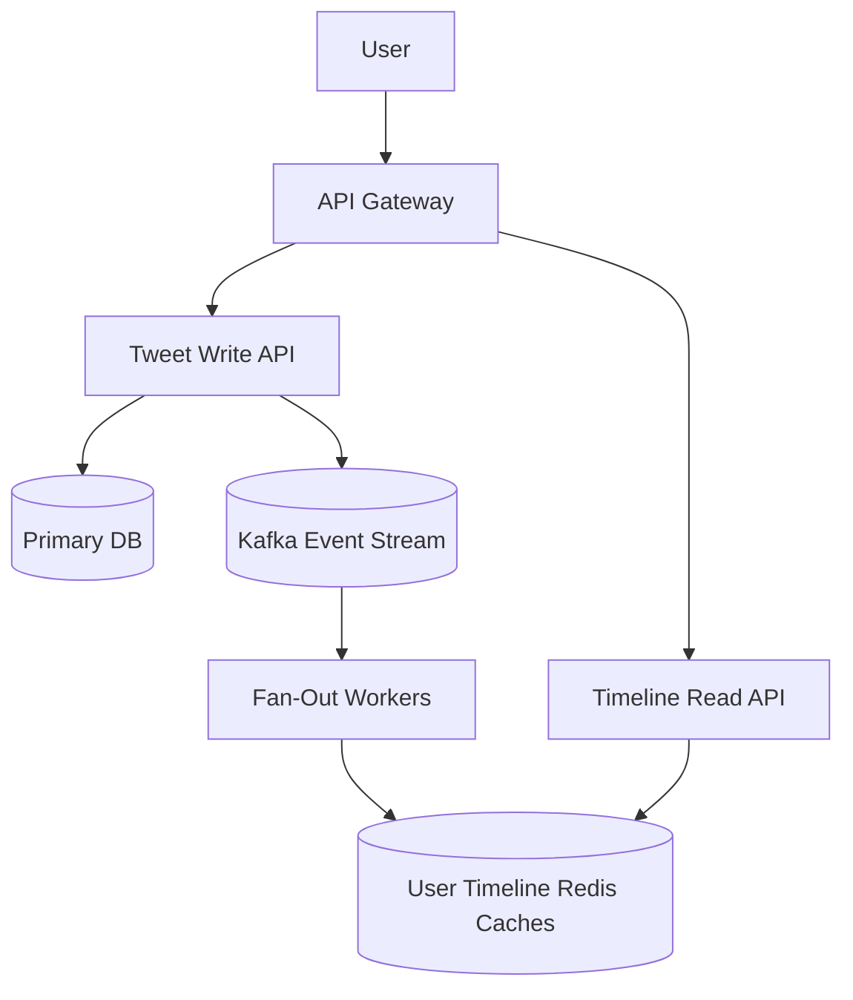

## Concept

**The Problem:** Design a platform where users can post short messages (Tweets), follow other users, and view a chronological "Home Timeline" consisting of tweets from everyone they follow.

This question tests your ability to handle massive **Read/Write Asymmetry** and complex Data Aggregation (The Fan-Out Problem).

## 1. Requirements

**Functional:**
- Users can post tweets (text + images).
- Users can follow/unfollow others.
- Users have a Home Timeline (tweets from people they follow).

**Non-Functional:**
- High Availability (It's okay if a tweet is delayed by 2 seconds, but the site must never go down).
- Read-Heavy: 100 Reads for every 1 Write.
- Fast Timeline Loading: Must load in < 200ms.

## 2. The Database Schema (Relational)

At its core, Twitter is simple.
- `User Table:` ID, Name, Handle.
- `Tweet Table:` ID, UserID, Content, Timestamp.
- `Follower Table:` FollowerID, FolloweeID.

## 3. The Core Challenge: Generating the Timeline

If User A follows 500 people, how do we generate their Home Timeline?

### Approach 1: Read-Time Fan-Out (Pull Model)
When User A opens the app, the server executes an SQL query: 
`SELECT * FROM tweets WHERE UserID IN (SELECT FolloweeID FROM FollowerTable WHERE FollowerID = A) ORDER BY Timestamp DESC LIMIT 20;`
- **Pros:** Writing a tweet is instant ($O(1)$).
- **Cons:** Generating the timeline is incredibly slow ($O(N)$). You have to join massive tables, sort millions of tweets in memory, and do it 10,000 times a second. The database will melt.

### Approach 2: Write-Time Fan-Out (Push Model)
Because Twitter is Read-Heavy, we must optimize the Read path. We do this by pre-computing the timeline.
We give every active user a dedicated **Timeline Cache** (a Redis List).
When User B posts a tweet, a background worker looks up all 500 people who follow User B, and *pushes* the Tweet ID into all 500 of their Redis Lists.
When User A opens the app, the server simply fetches User A's Redis List ($O(1)$).
- **Pros:** Reading the timeline is instant. Perfect for 99% of users.
- **Cons:** **The Justin Bieber Problem.**

## 4. The Justin Bieber Problem (Celebrity Fan-Out)

Justin Bieber has 100 million followers. If he tweets, the Write-Time Fan-Out model dictates that a background worker must push that Tweet ID into 100 million separate Redis Lists.
This will take minutes, consume massive Redis memory, and delay everyone else's tweets.

### The Hybrid Solution
You must combine Pull and Push.
1. Define users as **Normal** or **Celebrity** (e.g., > 100k followers).
2. For Normal users, use **Push Model**. When they tweet, push it to their followers' Redis lists.
3. For Celebrities, use **Pull Model**. When they tweet, do NOT push it anywhere. Just save it to the database.
4. **The Merge:** When User A opens the app, the server fetches User A's pre-computed Redis List (containing Normal tweets). It then explicitly queries the database for recent tweets from any Celebrities User A follows. It merges the two lists in memory, sorts them by timestamp, and returns them to the user.

## 5. High-Level Architecture

## Interview Questions

**Q: How do you handle pagination on the Home Timeline when new tweets are constantly arriving? If a user scrolls down to Page 2, they might see duplicates if new tweets shifted everything down.**
**A:** Do not use `OFFSET/LIMIT` pagination. You must use **Cursor-Based Pagination**. 
When the client fetches Page 1, it receives the tweets and notes the `Timestamp` (or `Tweet ID`) of the very last tweet on the screen. When the user scrolls down, the client requests Page 2, explicitly passing that `Tweet ID` as a cursor. The backend queries Redis/DB for "20 tweets older than this exact Tweet ID". This guarantees no duplicates, regardless of how many new tweets arrived at the top of the feed.

**Q: A massive news event happens, and 50,000 users try to retweet the exact same news article at the exact same millisecond. Your database write throughput is maxed out. How do you scale the writes?**
**A:** The database should not be hit synchronously during writes. The Tweet API should accept the HTTP POST request, instantly drop the tweet payload into a highly durable **Message Queue (Kafka)**, and return an HTTP 202 Accepted to the user. 
A pool of backend workers consumes the Kafka queue at a steady, manageable pace, writing the tweets to the database in bulk batches. This absorbs the massive spike (Shock Absorbing) without crashing the primary database.
