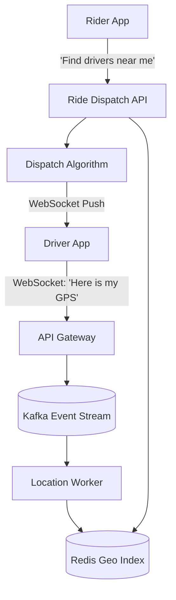

## Concept

**The Problem:** Design a ride-sharing service. 
1. Drivers constantly broadcast their current GPS location.
2. A Rider opens the app and sees nearby drivers.
3. The Rider requests a ride, and a nearby Driver accepts it.

This question tests your ability to handle **Geo-Spatial Data**, high-frequency location updates, and dispatch algorithms.

## 1. The Core Challenge: Location Tracking

If 1 million active drivers update their GPS coordinates every 5 seconds, that is 200,000 Writes per second. A standard PostgreSQL database will crash instantly if you try to `UPDATE drivers SET lat=?, long=?` at that speed.
Furthermore, how do you query "Find all drivers within a 3-mile radius of the Rider"? Running a complex Haversine math formula across a million rows in SQL is impossible in real-time.

### The Solution: Geohashing and Redis

We must use a specialized Geo-Spatial indexing strategy, typically **Geohash** or **S2 Geometry** (created by Google).
Geohashing divides the Earth into a grid of squares. Every square is assigned a short string code (e.g., `9q8yy`). If two locations are physically close to each other, they will share the same prefix (e.g., `9q8yy1` and `9q8yy2`).

**The Storage:** We use **Redis Geo**. Redis stores geospatial data purely in RAM and uses Geohashing under the hood, allowing for blisteringly fast reads and writes.

## 2. High-Level Architecture

## 3. The 3 Main Workflows

**1. Driver Location Updates:**
The Driver's phone opens a WebSocket and pushes GPS coordinates every 5 seconds. The Gateway drops this into Kafka. A worker reads Kafka and updates the Driver's location in Redis. (We only keep the *current* location in Redis. The historical breadcrumbs are saved asynchronously to a data warehouse like Hadoop for machine learning).

**2. Rider App Load:**
The Rider opens the app. The phone sends its GPS. The Ride API queries Redis: `GEORADIUS drivers_key rider_long rider_lat 3 km`. Redis instantly returns the IDs of the 10 closest drivers. The API returns this to the Rider's phone to draw the little cars on the map.

**3. The Dispatch (Matching):**
The Rider requests a ride. The Ride API creates a `RideObject` in PostgreSQL (`status: PENDING`). 
The Dispatch Algorithm uses Redis to find the 5 closest drivers. It pushes a WebSocket notification to Driver #1: "Accept ride?"
If Driver #1 ignores it for 10 seconds, the algorithm pushes the notification to Driver #2, until accepted. Once accepted, the PostgreSQL row is updated to `status: ACCEPTED, driver_id: 123`.

## 4. Handling Disconnects and Consistency

What happens if the Driver loses cell service while driving?
We maintain a Redis key with a TTL (Time To Live). When the driver sends a GPS update, we set their location and set `EXPIRE driver:123:location 15`. If the driver goes into a tunnel and stops sending updates, 15 seconds later, Redis automatically deletes them from the active map, preventing the Rider from seeing a "ghost car" that is stuck in place.

## Interview Questions

**Q: A million drivers updating their location every 5 seconds is massive network traffic. How can we reduce the load on the backend without sacrificing accuracy?**
**A:** We use **Client-Side Batching & Filtering**.
Instead of firing an HTTP request every 5 seconds, the Driver's phone records its GPS every second, batches 5 seconds worth of data into a small array, and sends it once.
Furthermore, the phone can use intelligent filtering. If the driver is stuck at a red light and hasn't moved more than 5 meters in the last 10 seconds, the phone simply stops sending updates entirely, drastically reducing network requests.

**Q: Why do we put Kafka between the API Gateway and the Location Worker? Why not just write straight to Redis?**
**A:** To act as a **Shock Absorber**. On New Year's Eve, the app will experience a massive, unprecedented spike in traffic. If the API tries to write directly to Redis synchronously, the sheer connection volume might overwhelm Redis or the API servers. By dropping the incoming GPS pings into Kafka instantly, we return a 200 OK to the Driver, and the workers pull the data from Kafka and write to Redis at a safe, steady pace. Even if the workers lag behind by 2 seconds, the system stays online.
