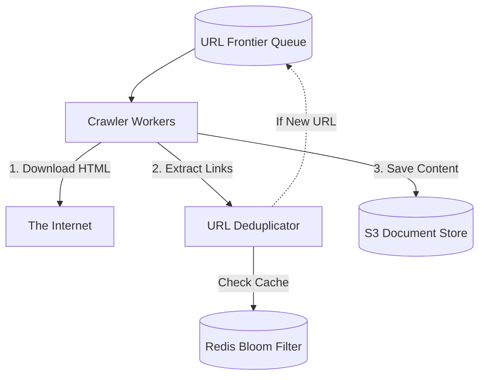

## Concept

**The Problem:** Design a system that starts with a few seed URLs, downloads the HTML of those web pages, extracts all the links on those pages, and then recursively visits those new links to download the entire internet.

This question tests your knowledge of **Graph Traversal (BFS/DFS)**, Distributed Queues, and avoiding infinite loops.

## 1. Requirements

**Functional:**
- Crawl the web starting from seed URLs.
- Extract HTML text and save it to a database for search indexing.
- Extract new URLs and add them to the queue.

**Non-Functional:**
- **Politeness:** Do not DDoS a website by hitting it 1,000 times a second.
- **Robustness:** Handle malicious traps (infinite loops, infinite redirects).
- Massive Scale: The internet has billions of pages.

## 2. The Core Architecture (The Loop)

A Web Crawler is fundamentally a massively distributed `while` loop implementing a Breadth-First Search (BFS) algorithm.

1. **The URL Frontier (Queue):** A distributed message queue containing all the URLs waiting to be visited.
2. **The HTML Downloader:** Worker nodes pop a URL from the queue, resolve the DNS, and download the raw HTML.
3. **The Extractor:** Parses the HTML, saves the text to a database (like AWS S3 or Cassandra), and extracts all `<a href>` tags.
4. **The Deduplicator:** The most critical component. It checks if the newly discovered URL has *already* been visited. If no, it pushes it into the URL Frontier queue.

## 3. High-Level Architecture

## 4. The Challenges and Solutions

### Challenge 1: The Deduplicator (Infinite Loops)
If Site A links to Site B, and Site B links back to Site A, your crawler will bounce between them infinitely. 
You must remember every single URL you have ever visited. Storing 10 billion URLs in RAM is impossible. 
**Solution:** We use a **Bloom Filter**. A Bloom Filter can store 10 billion URLs in just a few hundred Megabytes of RAM. When a new link is extracted, we ask the Bloom Filter: "Have we seen this?". If yes, we discard it. If no, we add it to the queue.

### Challenge 2: Politeness (Don't DDoS)
If a worker extracts 10,000 links to `wikipedia.org`, and pushes them to the queue, your workers might pull all 10,000 links simultaneously and crash Wikipedia's servers.
**Solution:** The URL Frontier is not one single queue. It is hundreds of separate queues, partitioned by domain name. There is a `wikipedia.org` queue and a `nytimes.com` queue. You assign exactly ONE worker thread to the `wikipedia` queue, and configure it with a forced 2-second sleep between downloads. This guarantees strict politeness.

### Challenge 3: Spider Traps
Malicious sites generate infinite dynamic URLs: `evil.com/page1` -> `evil.com/page1/a` -> `evil.com/page1/a/b`.
**Solution:** Implement strict limits. Maximum URL depth of 10. Maximum URL length of 255 characters. If a domain looks suspicious or generates too many dynamic paths, penalize it and deprioritize it in the queue.

## Interview Questions

**Q: Resolving a domain name to an IP address (DNS Lookup) takes 10-50 milliseconds. If you are downloading billions of pages, the DNS lookups alone will add years of latency to the crawl. How do you optimize this?**
**A:** You must implement a custom **DNS Cache** directly inside the Crawler Worker. When the worker resolves `wikipedia.org`, it caches the IP address in its local RAM. The next 10,000 requests to Wikipedia instantly use the cached IP, bypassing the network DNS request entirely.

**Q: Before downloading a page, a good crawler must check the `robots.txt` file of the website. If you download `robots.txt` for every single page you visit, you double your network traffic. How do you handle this?**
**A:** You download the `robots.txt` for a specific domain exactly *once*, and cache the rules in a distributed cache (like Redis) with a TTL of 24 hours. Before a worker downloads a URL, it checks the Redis cache to ensure the specific URL path is not explicitly blocked by the website administrator's rules.
