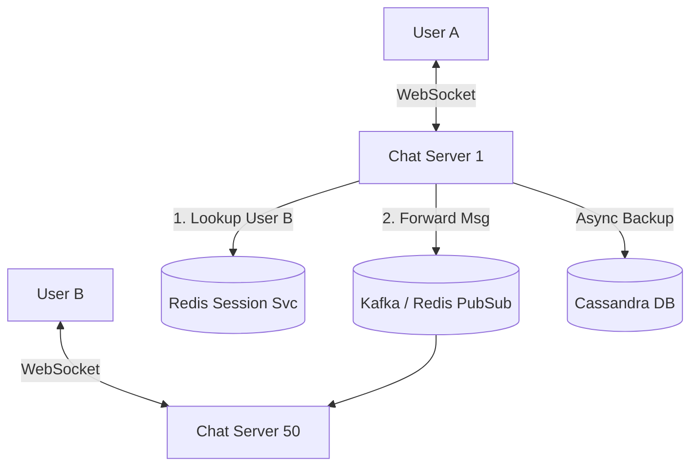

## Concept

**The Problem:** Design a real-time chat application where users can send 1-on-1 messages, see online/offline statuses, and receive read receipts.

Unlike Twitter (which is read-heavy), a Chat application is heavily **Write/Read symmetrical**. Every message sent is a message read. It requires maintaining millions of persistent, stateful connections.

## 1. Requirements

**Functional:**
- 1-on-1 real-time messaging.
- Message delivery statuses (Sent, Delivered, Read).
- User online status (Last Seen).

**Non-Functional:**
- Ultra-low latency.
- High Availability.
- Message Ordering (Messages must arrive in the exact order they were sent).

## 2. The Core Challenge: Real-Time Connection

HTTP/REST is stateless. Server A cannot "push" a message to User B.
We must use **WebSockets** to maintain persistent, bidirectional TCP connections between the users' phones and our servers.

### The Stateful Problem
If User A connects to `Chat Server 1`, that specific WebSocket lives in the RAM of `Server 1`. 
If User B connects to `Chat Server 50`, and sends a message to User A, `Server 50` has absolutely no idea where User A is located. 

### The Solution: The Session Service
We need a fast, centralized key-value store (like **Redis**) to track where every user is currently connected.
- Redis Table: `UserID -> ServerID` (e.g., `UserA -> Server1`)

**The Message Flow:**
1. User A sends "Hello" to User B via their WebSocket on Server 1.
2. Server 1 looks up User B in the Redis Session Service. It replies: `User B is on Server 50`.
3. Server 1 forwards the message over the internal network (via gRPC or a Pub/Sub queue) to Server 50.
4. Server 50 pushes the message down the WebSocket to User B.

## 3. High-Level Architecture

## 4. Message Storage and Delivery

If User B is offline (their phone is turned off), Server 1 will check Redis and find no active connection.
Server 1 must save the message to a Database.
When User B turns their phone on, their phone opens a WebSocket, connects to a Server, and immediately queries the Database: "Give me all messages with a timestamp > my last seen timestamp."

**Database Choice:** We need extreme write performance. **Cassandra** (NoSQL Wide-Column Store) is the industry standard for chat applications (Discord uses ScyllaDB, a C++ rewrite of Cassandra). We use `ChannelID` or `ThreadID` as the Partition Key, and `MessageID/Timestamp` as the Clustering Key, allowing us to instantly fetch sequential messages for a chat thread.

## 5. Online Presence (Last Seen)

Updating a database every time a user opens or closes the app is too slow.
Instead, the client app sends a "Heartbeat" ping over the WebSocket every 5 seconds.
The Chat Server receives the ping and updates a Redis key: `SET user:123:last_seen 16000000`.
To see if a user is online, you check the Redis key. If the timestamp is within the last 10 seconds, they are online. If older, they are offline.

## Interview Questions

**Q: A user is offline. You save 50 incoming messages to the Database. When they come online, their phone pulls the 50 messages. How do you guarantee the messages are displayed in the exact chronological order they were sent?**
**A:** Relying on the server's local clock timestamp is dangerous due to **Clock Skew** (Server 1 might be 50ms ahead of Server 50). To ensure perfect ordering in distributed systems, you must generate globally sequential, sortable IDs. You would use a system like **Snowflake ID**, which embeds a rough timestamp in the first 41 bits of the ID, ensuring that any ID generated globally at a later time will mathematically sort higher than an older ID, guaranteeing chronological ordering.

**Q: How does End-to-End Encryption (E2EE) change this architecture?**
**A:** With E2EE (like the Signal Protocol), the Chat Servers never see the plain text message. 
User A encrypts the message locally on their phone using User B's Public Key. User A sends the encrypted gibberish to the Chat Server. The Chat Server acts purely as a dumb router, forwarding the gibberish to User B. User B's phone uses their Private Key to decrypt it locally. 
This means the server cannot perform server-side searching, filtering, or AI moderation. All of that must be done on the client device.
