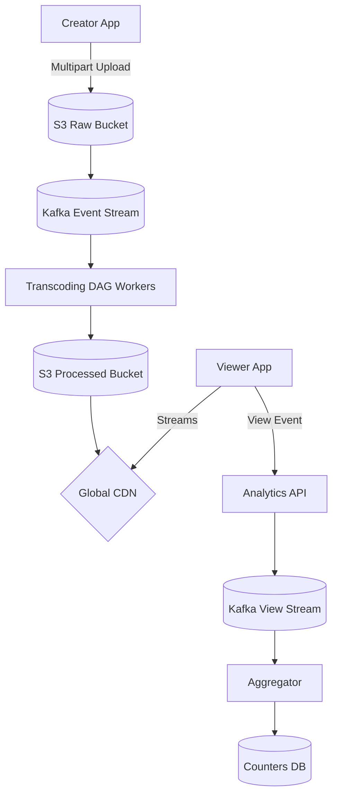

## Concept

**The Problem:** Design a platform where users can upload massive video files, and viewers can search for and stream those videos flawlessly across the globe.

*Note: This heavily overlaps with "Design Netflix", but introduces the complexity of User-Generated Content (UGC) and extremely high write volumes.*

## 1. Requirements & Estimation

**Functional:**
- Upload video.
- Stream video.
- Track view counts.

**Non-Functional:**
- High Availability.
- Handle massive bandwidth (Petabytes per day).

**Estimations:**
- 500 hours of video uploaded every *minute*.
- If 1 minute = 50MB (compressed), that is 25GB per minute, or 36 Terabytes of new data ingested *per day*.

## 2. The Upload Pipeline (The Write Path)

Uploading a 5GB 4K video from a phone over 3G takes hours. The connection will inevitably drop.

1. **Pre-Signed URLs:** The mobile app asks the API for permission to upload. The API returns an AWS S3 Pre-Signed URL. The mobile app uploads the massive file *directly* to S3, bypassing our Node.js servers entirely to prevent blocking our HTTP threads.
2. **Resumable Uploads:** The S3 upload uses the `Multipart Upload` protocol. The 5GB file is chopped into 5MB pieces on the phone. If the Wi-Fi drops at 99%, the phone only re-uploads the final 5MB piece.
3. **The Event:** S3 triggers an event to Kafka: "Raw Video 123 uploaded".
4. **Transcoding:** A fleet of background workers pull the raw video and transcode it. Because this takes hours, it is executed via a **Directed Acyclic Graph (DAG)** workflow.
   - Node 1: Extract Audio.
   - Node 2: Create 1080p stream.
   - Node 3: Create 480p stream.
   - Node 4: Generate Thumbnail sprite sheet.
5. **Distribution:** The final transcoded chunks (`.ts` files) are pushed to the global CDN network.

## 3. The Viewing Pipeline (The Read Path)

1. The user opens the app. The backend API fetches the metadata (Title, Uploader) from a fast database (Cassandra or MongoDB).
2. The API returns the URL of the `.m3u8` manifest file located on the CDN.
3. The video player begins streaming chunks directly from the local CDN edge server, adapting the resolution (1080p to 480p) dynamically based on the user's live Wi-Fi speed.

## 4. Tracking View Counts at Scale

If a MrBeast video gets 10 million views in an hour, you cannot execute `UPDATE videos SET views = views + 1` in PostgreSQL 10 million times. The row lock contention will crash the database.

**The Solution:**
We use an asynchronous, eventual consistency model.
1. When a user watches a video, the app fires a tiny UDP packet or HTTP POST to an API Gateway.
2. The Gateway drops the event into **Kafka**.
3. A streaming analytics worker (like Apache Flink or a simple Node.js consumer) pulls the events in batches. It aggregates them in memory: *"Video 123 got 5,000 views in the last 10 seconds."*
4. It writes the single aggregate number `+5000` to a fast NoSQL database (Cassandra) using an atomic counter.
5. Every few hours, a background cron job syncs the accurate Cassandra counter back to the primary PostgreSQL database for long-term storage.

## High-Level Architecture

## Interview Questions

**Q: A famous creator uploads a new video. The transcoding process takes 2 hours. They are angry because their fans can't see it immediately. How do you solve this?**
**A:** Transcoding a 4K 60fps video takes massive CPU. Instead of blocking the release, we process a low-quality `480p` version first. As soon as the `480p` version finishes (which takes 5 minutes), we instantly publish the video to the public and mark it "Live". While fans are watching the 480p version, the background workers leisurely finish processing the 1080p and 4K versions. Once complete, we silently add them to the CDN manifest, and the video players automatically upgrade the quality.

**Q: Storing 36 Terabytes of new video a day on AWS S3 Standard is incredibly expensive. Furthermore, 90% of videos on YouTube are watched once and never watched again. How do you optimize storage costs?**
**A:** We use **Tiered Storage Architecture**. 
When a video is uploaded, it sits in S3 Standard (Expensive, Millisecond access). 
We run a background data-mining job every night. If a video has received 0 views in the last 30 days, we automatically move the massive raw video file to **S3 Glacier Deep Archive** (100x cheaper, takes 12 hours to retrieve). We keep the compressed 480p version available. If a user randomly discovers the old video 5 years later, they watch the 480p version while a background worker issues a command to "thaw" the high-quality files from the Glacier.
