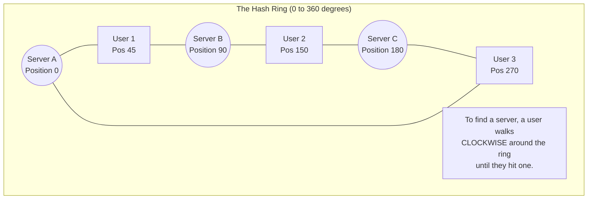

## Concept

When a Load Balancer uses standard IP hashing (`hash(user_ip) % num_servers`) to route traffic, adding or removing a single server changes the denominator (`num_servers`). This instantly recalculates the route for *every single user*, causing a massive disruption. 
**Consistent Hashing** is a distributed hashing scheme that maps data to nodes on an abstract "ring". If a node is added or removed, it only affects the data immediately adjacent to it, leaving 90%+ of the traffic completely undisturbed.

## Mental Model: The Hash Ring

## How It Works

Instead of using the modulo of the *number* of servers, we use a fixed, massive modulo (like `2^32 - 1`) to create an imaginary circle or "ring".

1. **Hash the Servers:** We take the IP address of Server A, B, and C, hash them, and place them on the ring (e.g., at positions 0, 90, and 180).
2. **Hash the Users:** We take the IP of the incoming User, hash it, and place it on the ring (e.g., position 150).
3. **Route the Traffic:** The user "walks" clockwise around the ring from position 150. The first server they bump into is Server C (at position 180). Therefore, the Load Balancer routes the user to Server C.

**The Magic of Adding/Removing Servers:**
If Server B (position 90) crashes, only the users between Server A (0) and Server B (90) will be affected. When they walk clockwise past 90, Server B is gone, so they keep walking and hit Server C. *User 2 and User 3 are completely unaffected!*

## Trade-Offs

- **The Problem: Uneven Distribution.** Because server hashes are random, Server A and B might land very close to each other on the ring, while Server C is far away. Server C will end up absorbing a massive portion of the clockwise traffic.
- **The Solution: Virtual Nodes.** Instead of placing Server A on the ring once, we hash it 100 times using slight variations (`ServerA_1`, `ServerA_2`). This places 100 "Virtual Nodes" for Server A evenly scattered across the ring. We do the same for B and C. This guarantees perfectly even load distribution.

## Real-World Usage

Consistent Hashing is not just for Load Balancers. It is the fundamental backbone of modern Distributed Databases and Caches.
- **Amazon DynamoDB & Apache Cassandra:** Use consistent hashing to figure out exactly which cluster node should store a specific piece of data (Sharding/Partitioning).
- **Discord:** Uses consistent hashing to route websocket connections to the correct Chat Server based on the `guild_id`.

## Interview Questions

**Q: You have a cluster of 5 Redis cache servers holding 100GB of profile pictures. You use standard hashing `hash(image_id) % 5`. You add a 6th server to handle increased load. What happens to your database?**
**A:** This triggers a "Cache Stampede" and will likely bring down the main database. Because the modulo changed from 5 to 6, almost every single `image_id` will hash to a different server. When users request pictures, the cache servers will report a "Cache Miss" for 83% of the images. All 5 servers will simultaneously forward thousands of requests to the main underlying database to fetch the images, crushing it instantly.

**Q: How does Consistent Hashing with Virtual Nodes help when servers have different hardware capacities?**
**A:** If Server A has 64GB of RAM and Server B has 32GB of RAM, we simply create twice as many Virtual Nodes for Server A. We put 200 virtual nodes for A on the ring, and 100 virtual nodes for B. This naturally funnels twice as much traffic to the beefier server.
