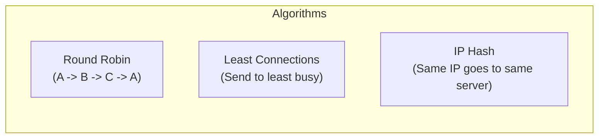

## Concept

A Load Balancer needs a mathematical strategy to distribute incoming requests across the backend servers. Choosing the wrong algorithm can lead to "hot spots"—where one server is overwhelmed at 100% CPU while others sit idle at 5%.

## Mental Model

## The Primary Algorithms

### 1. Round Robin
- **How it works:** Iterates through the list of servers in order. Request 1 goes to Server A, Request 2 to Server B, Request 3 to Server C, Request 4 back to Server A.
- **Pros:** Simple, deterministic, fast.
- **Cons:** Assumes all servers have the exact same hardware capacity and that all requests take the exact same amount of time to process. If Server A gets heavy video-encoding requests, and Server B gets lightweight text requests, Server A will crash while B sits idle.

### 2. Weighted Round Robin
- **How it works:** You assign a "weight" to each server based on its hardware. If Server A has 64GB of RAM (Weight 2) and Server B has 32GB (Weight 1), Server A will receive two requests for every one request sent to Server B.
- **Use Case:** Migrating to a new server fleet. You can slowly send 10% of traffic to the new servers while keeping 90% on the old ones.

### 3. Least Connections
- **How it works:** The Load Balancer keeps track of how many active TCP connections each server currently has open. It sends the new request to the server with the fewest active connections.
- **Pros:** Perfect for workloads where requests have highly variable processing times (e.g., long-polling, web sockets, heavy database queries). It actively prevents hot spots.

### 4. IP Hash (or URL Hash)
- **How it works:** The LB takes the Client's IP address (or the requested URL), runs it through a cryptographic hash function, and uses modulo arithmetic `hash(IP) % num_servers` to pick a server. 
- **Pros:** Ensures that a specific user (based on their IP) will *always* be routed to the exact same server.
- **Use Case:** Implementing "Sticky Sessions" without using cookies, or maximizing local cache hits (e.g., routing all requests for `/video/cat.mp4` to the specific server that already has that video loaded in its RAM).

## Real-World Usage

- **Nginx Defaults:** Nginx defaults to standard Round Robin. 
- **AWS Application Load Balancer (ALB):** Historically defaulted to Round Robin, but AWS introduced "Least Outstanding Requests" (a variant of Least Connections) as the recommended default for applications to prevent request pile-ups.

## Interview Questions

**Q: You use IP Hashing to route users. You have 4 servers. Server 2 crashes. What happens?**
**A:** This is the massive flaw of standard modulo hashing (`hash % 4`). When Server 2 crashes, the denominator changes to `3`. The math changes for *every single user*. Almost every user will suddenly be routed to a completely different server, wiping out all their session states and local caches simultaneously (a cache stampede). This is solved by using **Consistent Hashing** instead of standard modulo arithmetic.

**Q: Why might Least Connections fail to distribute load evenly in a microservices architecture?**
**A:** Least Connections only tracks the *number* of open connections, not the CPU utilization. If a server has 5 open connections doing incredibly heavy video processing, and another has 10 open connections just sending idle heartbeat pings, Least Connections will send the next request to the overloaded video server. Advanced LBs use algorithms like "Least Response Time" or actively poll the servers for their CPU metrics to make smarter routing decisions.
