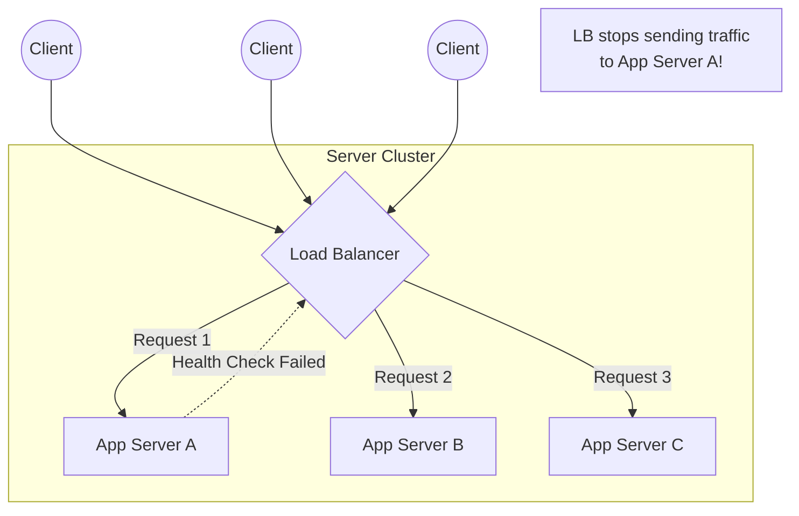

## Concept

A **Load Balancer (LB)** is a critical piece of infrastructure that sits between the client and the server cluster. Its primary job is to distribute incoming network traffic across multiple backend servers. This prevents any single server from becoming a bottleneck, ensuring high availability, reliability, and horizontal scalability.

## Architecture Diagram

## How It Works

**1. Traffic Distribution:**
The LB receives a request on a public IP address. It uses an algorithm (like Round Robin) to pick a backend server with a private IP address, forwards the request, receives the response, and sends it back to the client.

**2. Health Checks:**
The LB constantly pings the backend servers (e.g., checking an `/api/health` endpoint every 5 seconds). If Server A stops responding or returns a 500 error, the LB removes it from the pool. Traffic is seamlessly routed only to the healthy servers.

**Types of Load Balancers (OSI Model):**
- **Layer 4 (L4) Load Balancer (Network Level):** Looks only at the IP address and TCP/UDP port. It doesn't inspect the contents of the packet. It simply forwards the bytes. Extremely fast (e.g., AWS Network Load Balancer).
- **Layer 7 (L7) Load Balancer (Application Level):** Looks inside the HTTP payload. It can route traffic based on the URL path (`/images` goes to Server A, `/api` goes to Server B), read cookies, and inspect headers. Slower, but much smarter (e.g., AWS Application Load Balancer, Nginx).

## Trade-Offs

- **Pros:** Unlocks horizontal scaling, protects backend servers from direct internet exposure, manages SSL termination (decrypting HTTPS traffic at the LB to save CPU cycles on the app servers).
- **Cons:** It introduces a new Single Point of Failure (SPOF) if you only have one LB. It adds a slight network latency hop.

## Real-World Usage

- **Hardware LBs:** Expensive, physical machines (like F5 Networks). Used by massive legacy enterprises or telecom companies.
- **Software LBs:** Nginx, HAProxy. You install them on a Linux server. Extremely common and highly configurable.
- **Cloud Managed LBs:** AWS ALB, Google Cloud Load Balancing. The cloud provider automatically scales the load balancer itself behind the scenes. This is the modern default for startups and SaaS.

## Interview Questions

**Q: A user logs into your website. Their next request hits a different server behind the load balancer, and they are suddenly logged out. How do you fix this?**
**A:** This is the classic "Session State" problem. There are two fixes:
1. **Sticky Sessions (Session Affinity):** Configure the Load Balancer to inject a cookie into the user's browser. The LB reads this cookie on subsequent requests and always routes that specific user to the same server. (Downside: It unevenly distributes load if one user is extremely active).
2. **Stateless Servers (Preferred):** Move the session data out of the server's local RAM and into a centralized distributed cache like Redis. Now, it doesn't matter which server the Load Balancer picks; they all query Redis to verify the user.

**Q: When would you explicitly choose a Layer 4 Load Balancer over a Layer 7?**
**A:** If I am building a massively multiplayer online game (MMO) that uses raw UDP packets for real-time player movement, I must use a Layer 4 LB. Layer 7 LBs only understand HTTP/HTTPS application protocols, not raw UDP streams. L4 is also preferred for pure database load balancing where traffic is raw TCP.
