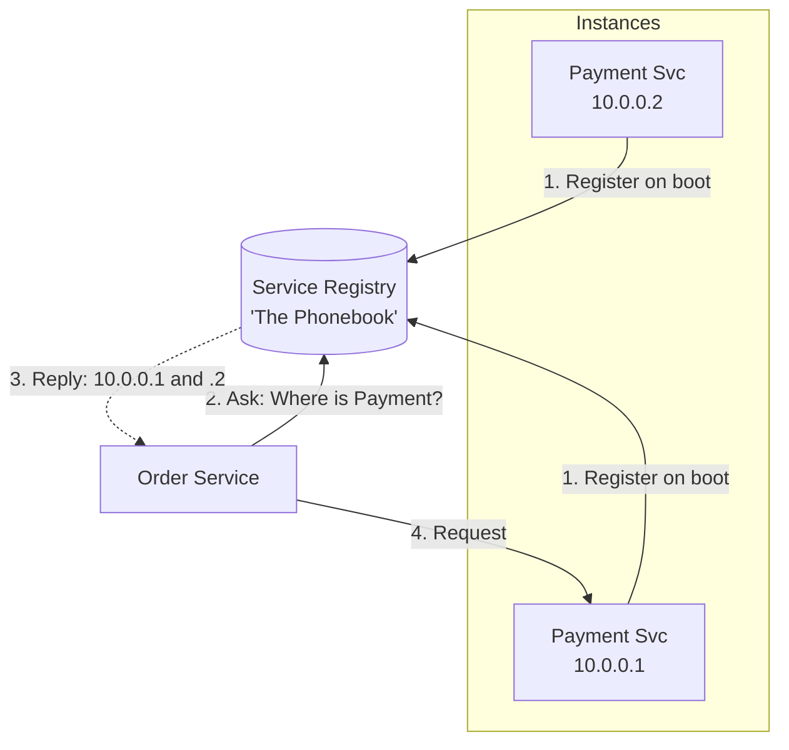

## Concept

In a monolithic architecture, the App server connects to the Database using a hardcoded IP address in a configuration file. In a modern Microservices architecture deployed on Kubernetes or AWS EC2 Auto-Scaling, servers are dynamically created and destroyed every minute. IP addresses change constantly. **Service Discovery** is the mechanism that allows Service A to find the current, active IP address of Service B without hardcoding anything.

## Mental Model

## How It Works

There are two main components to Service Discovery:

**1. The Service Registry (The Phonebook):**
A highly available, centralized database that holds a list of all currently active microservices and their IP addresses. (e.g., Consul, ZooKeeper, etcd).

**2. The Discovery Pattern:**
- **Client-Side Discovery:** Service A queries the Registry, gets a list of all IP addresses for Service B, picks one using its own internal load balancing logic, and makes the request directly.
- **Server-Side Discovery:** Service A sends the request to an API Gateway or Load Balancer. The Load Balancer queries the Registry, picks an IP, and forwards the request. Service A never knows the actual IP.

## Health Checking

Service Discovery is useless if it hands out IP addresses of dead servers. 
- **Heartbeats:** Every microservice must ping the Registry every few seconds ("I am alive"). If the Registry misses 3 heartbeats from an IP, it deletes the IP from the phonebook.

## Real-World Usage

- **Kubernetes (K8s):** Kubernetes has built-in server-side service discovery. When you create a `Service` in K8s, it automatically assigns it an internal DNS name (e.g., `http://payment-service:8080`). The K8s internal DNS server (CoreDNS) acts as the registry and load balancer.
- **HashiCorp Consul:** The industry standard for managing service discovery across hybrid clouds (e.g., some VMs on AWS, some on on-premise hardware). It uses DNS to resolve service names to healthy IPs.

## Interview Questions

**Q: In Client-Side Service Discovery, what happens if the Service Registry crashes? Does your whole application go offline?**
**A:** It shouldn't, if implemented correctly. Client-Side discovery tools (like Netflix Eureka/Ribbon) heavily cache the registry data locally. If the Registry goes down, the Order Service will just use the last known good IP addresses for the Payment Service. It won't be able to discover *new* servers, but the existing ones will continue to communicate until the Registry recovers.

**Q: Why use Zookeeper or etcd for a Service Registry instead of just spinning up a standard MySQL database?**
**A:** A Service Registry must be highly available and perfectly consistent (CP in the CAP theorem). If the registry goes down, your entire cluster halts. Zookeeper and etcd are specialized Key-Value stores built on distributed consensus algorithms (Raft/Paxos). They automatically replicate data across a cluster of odd-numbered nodes (3, 5, 7) and elect a new leader instantly if one fails, providing absolute reliability that a single MySQL instance cannot.
