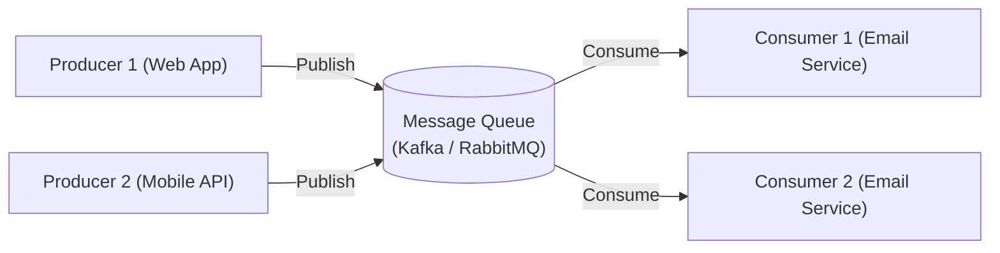

## TL;DR

A Message Queue (like RabbitMQ, Kafka, or SQS) is an asynchronous service-to-service communication mechanism. It allows a "Producer" to send messages to a queue, where they are securely stored until a "Consumer" is ready to process them.

## Mental Model

## Why use Message Queues?

1. **Decoupling**: The Web App doesn't need to know anything about the Email Service. They don't even need to be written in the same language.
2. **Asynchronous Processing**: Instead of making the user wait 5 seconds while a video is compressed, the Web App instantly returns "Processing..." and sends a message to the queue. A background worker handles the compression.
3. **Buffering / Traffic Spikes**: If 10,000 users upload photos at once, the queue stores the messages safely. The image processing consumers process them at their own steady pace without crashing.
4. **Reliability**: If the Email Service goes offline, the messages stay safely in the queue until the service reboots. No data is lost.

## Message Queue Patterns

### 1. Point-to-Point (Work Queues)
A message is sent to a specific queue. Multiple consumers can listen to the queue, but each message is processed by **exactly one** consumer. Great for distributing workloads (e.g., Image processing). (Best tool: *RabbitMQ, SQS*).

### 2. Publish-Subscribe (Pub/Sub)
A message is sent to a "Topic". Multiple consumers can subscribe to the topic, and **every** subscriber gets a copy of the message. Great for events (e.g., UserCreated event triggers both the WelcomeEmail service and the Analytics service). (Best tool: *Kafka, SNS*).

## Interview Questions

### What is the difference between "At-most-once", "At-least-once", and "Exactly-once" delivery?
- **At-most-once**: Messages might be lost, but are never duplicated.
- **At-least-once**: Messages are never lost, but might be duplicated if a consumer crashes before acknowledging it. (Most common).
- **Exactly-once**: The holy grail. Extremely difficult and slow to implement due to the two-phase commit overhead.

### How do you handle poison messages?
If a message is malformed and causes the consumer to crash every time it tries to process it, it will create an infinite loop. Use a **Dead Letter Queue (DLQ)**. If a message fails processing N times, it is automatically moved to the DLQ for manual inspection.

## Remember

> Message Queues are the backbone of event-driven microservices. They turn fragile, synchronous chains of API calls into resilient, asynchronous workflows.
