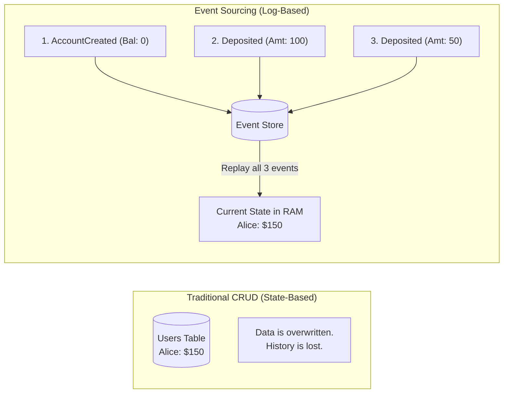

## Concept

In a traditional database (CRUD), if Alice has $100 and deposits $50, you run an `UPDATE` query to change her balance to $150. The previous state ($100) is overwritten and destroyed forever.
In **Event Sourcing**, you do *not* store the current state. Instead, you store an immutable, append-only log of every single action (Event) that has ever happened to the system. To find Alice's current balance, you load the log and replay all the events from the beginning of time.

## Mental Model

## How It Works

1. **The Event Store:** The primary source of truth is the Event Log (usually Apache Kafka, or a specialized database like EventStoreDB). It is append-only. You can never `UPDATE` or `DELETE` an event.
2. **Rehydration (Replaying):** When the application needs to know a user's current balance, it fetches all events for that user ID and mathematically folds them together (reduces them) in memory to calculate the final state.
3. **Snapshots:** Replaying 10,000 events every time a user logs in is slow. To fix this, the system periodically takes a "Snapshot" of the state at a specific point in time (e.g., at Event #5000, balance was $500). The next time, the system loads the snapshot and only replays the events that happened *after* Event #5000.

## Trade-Offs

- **Pros:** 
  - **The Ultimate Audit Log:** Perfect for financial and legal systems. You can prove exactly how a user arrived at their current state.
  - **Time Travel:** You can rebuild the exact state of the system as it existed on March 15th simply by replaying the log and stopping at that date.
  - **Bug Fixing:** If a bug in your code calculated interest incorrectly for 3 months, you can deploy a fix, delete the corrupted read-database, and replay the raw events through the *new* code to perfectly regenerate the correct data.
- **Cons:** **Massive Complexity.** Reading data is slow. Querying the system for "Find all users with a balance > $100" is virtually impossible from a raw event log, which forces you to implement the **CQRS pattern** (Command Query Responsibility Segregation) alongside it.

## Real-World Usage

- **Banking/Ledgers:** The core concept of double-entry bookkeeping has used event sourcing for centuries.
- **Git / Version Control:** Git is fundamentally an event-sourced system. The codebase you see on your screen is just a projection. The true data is the immutable log of commits (events).
- **Redux (React):** The Redux state management library enforces event sourcing on the frontend. The `state` cannot be modified directly; you must `dispatch` an `action` (event), and a `reducer` calculates the new state.

## Interview Questions

**Q: You are using Event Sourcing for an e-commerce site. A user requests the deletion of their account under GDPR "Right to Be Forgotten" laws. But Event Sourcing explicitly forbids deleting or altering past events. How do you comply with the law?**
**A:** This is a famous problem. The solution is **Crypto-Shredding**.
When the user creates an account, you encrypt all of their Personally Identifiable Information (PII) using a unique encryption key specifically generated for that user. You store the events in the Event Store encrypted. You store the encryption key in a separate, standard CRUD database.
When the user requests deletion, you simply `DELETE` their encryption key from the separate database. The immutable events remain in the Event Store forever to preserve the financial ledgers, but the PII inside them is instantly and permanently rendered as unreadable gibberish, fulfilling the GDPR requirement.
