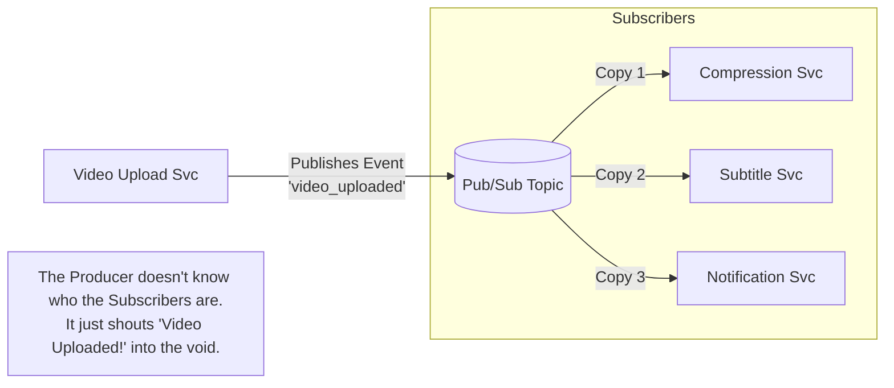

## Concept

In a standard Message Queue (Point-to-Point), a message is processed by exactly *one* Consumer and then deleted. 
But what if a user uploads a video, and you need three completely different things to happen? You need to 1) Compress the video, 2) Extract the audio for subtitles, and 3) Send a push notification to their followers.
The **Publish-Subscribe (Pub/Sub)** pattern solves this. The Producer publishes a single event to a "Topic". Multiple independent Consumers subscribe to that Topic, and *every* subscriber gets their own copy of the event.

## Mental Model

## How It Works

1. **Publisher:** Generates an Event (e.g., `{"user": "Alice", "action": "checkout"}`). It tags the event with a Topic name and fires it off.
2. **Topic (or Exchange):** A logical channel on the Broker. It does not store data long-term; it acts as a router.
3. **Subscriber:** Services that declare interest in a specific Topic. When the Topic receives a message, it duplicates it and pushes it out to all active Subscribers.

**Fire and Forget vs Durability:**
Many basic Pub/Sub systems (like Redis Pub/Sub) are "Fire and Forget". If the Subtitle Service happens to be offline/rebooting when the `video_uploaded` event is broadcast, it misses the message entirely. To fix this, enterprise systems combine Pub/Sub with standard Message Queues.

## The Fan-Out Pattern

To achieve durability in Pub/Sub, we use the **Fan-Out Pattern**.
Instead of pushing messages directly to volatile Subscribers, the Pub/Sub Topic pushes copies of the message into separate, durable Message Queues dedicated to each service.
- The Topic copies the message into the `Compression_Queue` and the `Subtitle_Queue`.
- The Subtitle Service reads from its own `Subtitle_Queue` at its own pace. If it crashes, the message safely waits in the queue until it reboots.

## Real-World Usage

- **Apache Kafka / Amazon Kinesis:** The undisputed kings of massive-scale Pub/Sub and event streaming.
- **Amazon SNS (Simple Notification Service):** A classic AWS service designed purely to fan-out messages to SQS queues, Lambda functions, or directly to emails/SMS.
- **WebSockets / Socket.io:** Use the Pub/Sub pattern heavily. A chat room is a Topic. When User A publishes a message, the server pushes it to all users subscribed to that chat room.

## Interview Questions

**Q: You use Amazon SNS (Pub/Sub) connected to Amazon SQS (Queues) using the Fan-Out pattern. Your application requires that video processing is strictly ordered. Does this pattern guarantee order?**
**A:** **No.** Standard Pub/Sub topics and standard Queues do not guarantee strict ordering. In a highly distributed environment, message 2 might arrive in the queue before message 1. If absolute strict ordering is required (e.g., processing financial ledgers), you must use specialized tools like **Kafka Partitions** or **AWS SQS FIFO Queues**, which enforce order but severely limit horizontal scalability.

**Q: Explain the difference between an "Event" (Pub/Sub) and a "Command" (Message Queue).**
**A:** This is a crucial architectural distinction:
- **Command (Message Queue):** Directed from a Producer to a specific Consumer. It tells a system *to do something* in the future. (e.g., `GenerateInvoiceCommand`). It is handled by exactly one worker.
- **Event (Pub/Sub):** Broadcasted to anyone who cares. It states a fact about *something that has already happened in the past*. (e.g., `OrderCheckedOutEvent`). The Producer does not care who listens or what they do with the information.
