## Concept

In a monolith, tracking performance is easy: you wrap a function call in a timer. 
In a microservices architecture, a single user click might trigger a chain reaction of HTTP requests across 15 different servers. If the final response takes 4 seconds, how do you know which of the 15 servers was slow?
**Distributed Tracing** solves this by generating a unique ID at the front door and passing it down the chain, allowing you to stitch the entire journey together into a single visual timeline.

## Mental Model

```mermaid
gantt
    title Trace ID: 9f8a3... (Total Time: 4.5s)
    dateFormat  s
    axisFormat %S
    
    section API Gateway
    Forward Request  :a1, 0, 0.5s
    
    section Auth Service
    Validate Token   :a2, 0.5, 1s
    
    section Payment Service
    Stripe API Call  :crit, a3, 1.5, 3s
    
    section Order Service
    Save to DB       :a4, 4.5, 0.5s
```

## How It Works

1. **The Trace ID:** When a request hits the edge of your system (the API Gateway), the gateway generates a globally unique UUID (e.g., `TraceID: 123`).
2. **Context Propagation (The Hard Part):** The Gateway sends an HTTP request to the Auth Service. It *must* attach `TraceID: 123` to the HTTP Headers (often standard headers like `X-B3-TraceId` or W3C `traceparent`). 
3. **Passing the Baton:** The Auth Service reads the header. When the Auth Service makes its own HTTP request to the Database, it must inject that exact same `TraceID: 123` into the database query headers.
4. **Spans:** Every time a service does work, it creates a "Span" (a block of time with a Start and End timestamp, tagged with the `TraceID`).
5. **Collection:** All 15 services asynchronously fire their Spans to a central tracing backend (like Jaeger). The backend groups all spans with `TraceID: 123` together and draws the Gantt chart.

## OpenTelemetry (OTel)

Historically, every tracing tool (Datadog, New Relic, Jaeger) required you to install their specific, proprietary SDK into your code. If you wanted to switch vendors, you had to rewrite all your logging code.
**OpenTelemetry** is the modern CNCF open-source standard. You instrument your code exactly once using the OpenTelemetry SDK. It generates standardized tracing data and sends it to an "OTel Collector". You can then configure the Collector to forward the data to Jaeger, Datadog, or anywhere else without ever touching your application code again.

## Trade-Offs

- **Pros:** The only practical way to debug latency and bottlenecks in deeply nested microservice architectures.
- **Cons:** 
  - **Massive Storage Costs:** Generating and saving thousands of tracing spans for every single user click will bankrupt your company in AWS storage fees.
  - **Code Pollution:** Ensuring that every single developer remembers to extract the Trace ID from incoming requests and inject it into outgoing requests is a massive engineering culture challenge (though Service Meshes automate much of this).

## Interview Questions

**Q: Since storing 100% of distributed traces is too expensive, how do you decide which traces to keep?**
**A:** You must implement **Sampling**. There are two types:
1. **Head-Based Sampling:** The API Gateway rolls a dice. It decides to keep only 1% of traffic. If the dice rolls true, it attaches a "Sampled: True" flag to the Trace ID. All downstream services see the flag and save their spans. (Pro: Easy. Con: You might accidentally throw away the trace of a rare, critical error).
2. **Tail-Based Sampling:** Every service generates and sends 100% of their spans to a central Collector's RAM buffer. The Collector analyzes the full completed trace. If the trace represents a fast, boring, successful 200 OK request, the Collector throws it in the trash. If the trace contains a 500 Error or took unusually long (an anomaly), the Collector permanently saves it to the database. This guarantees you only pay storage for traces you actually care about.
