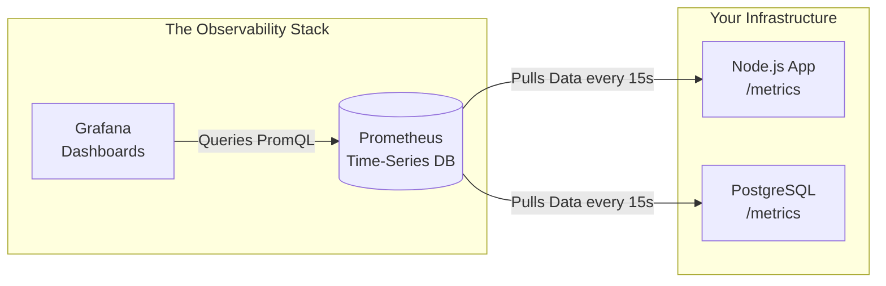

## Concept

To know if your servers are melting down, you need a system to collect numerical metrics (CPU %, active users, memory usage) and draw pretty charts so humans can understand them.
In the modern Cloud-Native era, the undisputed open-source king of this workflow is the pairing of **Prometheus** (the database that collects the numbers) and **Grafana** (the visualization tool that draws the charts).

## Mental Model

## How It Works: The Pull Model

The most unique architectural feature of Prometheus is that it uses a **Pull Model** (Scraping).

1. **The Exporter:** Your Node.js application does *not* push metrics to Prometheus. Instead, you install a tiny library that exposes a simple HTTP endpoint on your server (usually `http://your-server.com/metrics`). This endpoint returns raw, plain-text data (e.g., `http_requests_total 1053`).
2. **The Scrape:** Prometheus is configured with a list of all your server IP addresses. Every 15 seconds, Prometheus aggressively makes HTTP GET requests to all those `/metrics` endpoints, pulls the numbers, and saves them to its internal Time-Series Database (TSDB).
3. **The Query:** Grafana connects to Prometheus and uses **PromQL** (Prometheus Query Language) to aggregate the data (e.g., `rate(http_requests_total[5m])` calculates the requests-per-second over a 5-minute window) and renders it as a line chart.

## Trade-Offs of the Pull Model

- **Pros:** 
  - **No DDoS'ing the monitoring server:** If you have 10,000 microservices, and they all simultaneously decide to push massive metrics payloads to a central server, they will crash the monitoring tool. By forcing Prometheus to *Pull*, Prometheus strictly controls the ingestion rate and protects itself.
  - **Easy Debugging:** If metrics are broken, a developer can literally just open their web browser, go to `http://localhost:3000/metrics`, and read the raw text to see if the app is generating the numbers correctly.
- **Cons:** Prometheus must know the IP address of every single server in your cluster. In highly dynamic environments like Kubernetes, where Pod IPs change every minute, Prometheus requires complex "Service Discovery" integrations to constantly update its target list.

## Real-World Usage

- Prometheus is designed for high-reliability alerting. It sits right alongside your Kubernetes clusters.
- If CPU usage exceeds 90%, Prometheus triggers its "Alertmanager" component, which fires an API call to PagerDuty or Slack, waking up an engineer at 3:00 AM.
- **Grafana** is completely database-agnostic. While it is usually paired with Prometheus, it can draw charts by querying PostgreSQL, Elasticsearch, or AWS CloudWatch directly.

## Interview Questions

**Q: You have a Node.js background worker that wakes up, processes a queue message for 2 seconds, and immediately shuts down completely. Why is the Prometheus Pull Model fundamentally broken for this use case, and how do you fix it?**
**A:** The Prometheus Pull Model usually scrapes endpoints every 15 seconds. If the background worker only lives for 2 seconds, Prometheus will completely miss it. The worker spins up and dies between the scrape intervals, so its metrics are lost forever.
**Fix:** You must use the **Prometheus Pushgateway**. The ephemeral background worker actively *pushes* its final metrics to the Pushgateway just before shutting down. The Pushgateway stays online permanently and holds those metrics in its RAM. Prometheus then leisurely scrapes the Pushgateway every 15 seconds to collect the data.
