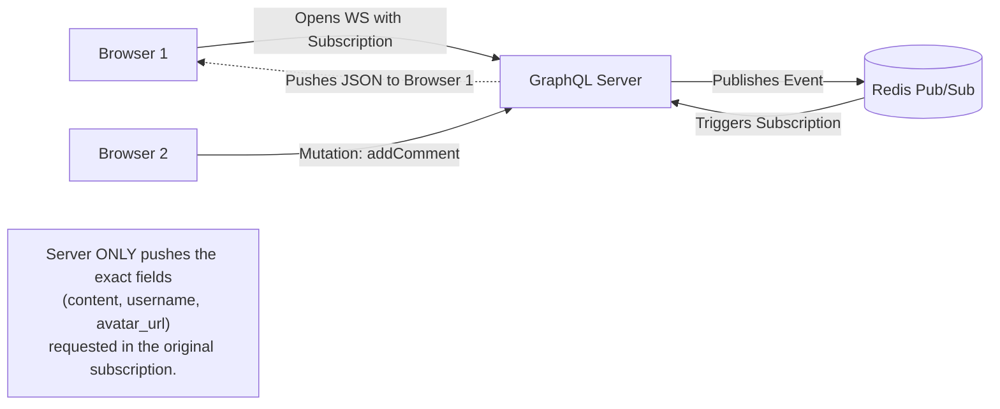

## Concept

In standard GraphQL, a Client uses a `Query` to fetch data once, or a `Mutation` to modify data once. 
If the Client wants to know when data changes in real-time (e.g., waiting for a new comment on a post), they use a **GraphQL Subscription**. Under the hood, this usually creates a persistent WebSocket connection, but the data streaming over the socket is strictly formatted according to the complex rules of the GraphQL schema.

## Mental Model

```graphql
# The Client sends this Subscription query over a WebSocket
subscription {
  commentAdded(postID: "123") {
    id
    content
    author {
      username
      avatar_url
    }
  }
}
```



## How It Works

1. **The Transport Layer:** The Client library (like Apollo Client) opens a WebSocket connection to the GraphQL Server using a specialized sub-protocol (like `graphql-ws`).
2. **The Handshake:** The Client sends the `subscription` document. The Server validates the query against its schema and holds the connection open.
3. **The Pub/Sub Backend:** Deep inside the backend architecture, the GraphQL server must be wired up to a Pub/Sub system (like Redis Pub/Sub or Kafka). 
4. **The Trigger:** When User B posts a comment, the Mutation resolver publishes a `COMMENT_ADDED` event to Redis. 
5. **The Resolution:** The Server hears the Redis event, looks up all active WebSocket connections listening for `COMMENT_ADDED` on that specific `postID`, executes the GraphQL resolvers to fetch the requested fields (author name, avatar), and pushes the tailored JSON payload down the pipe.

## Trade-Offs

- **Pros:** 
  - **Over-fetching solved:** Just like standard GraphQL, the client defines exactly what real-time data it wants. If it only wants the `id` of the new comment, the server doesn't waste bandwidth pushing the whole comment body.
  - **Unified API:** Developers use the exact same syntax and tooling for one-off reads, writes, and real-time streams.
- **Cons:** 
  - **Extreme Server Load:** WebSockets are already stateful and heavy. Combining them with the CPU-intensive nature of GraphQL resolvers (which might trigger N+1 database queries *for every single active subscriber*) can crush a server instantly if not heavily optimized with DataLoaders.
  - **Complexity:** Setting up the internal Pub/Sub machinery to make subscriptions work in a distributed server environment is notoriously difficult.

## Real-World Usage

- **Apollo Server / Hasura:** The most common platforms for implementing GraphQL Subscriptions.
- **Use Cases:** Live comment feeds, real-time upvote counters, typing indicators.

## Interview Questions

**Q: You deploy a GraphQL server to 3 instances behind a Load Balancer. User A connects a WebSocket to Instance 1 and subscribes to `postUpdated`. User B connects to Instance 2 and executes the `updatePost` mutation. Why does User A never receive the real-time update, and how do you fix it?**
**A:** The GraphQL instances are stateless and completely unaware of each other. The mutation executed on Instance 2 published an event *in the local memory* of Instance 2. Instance 1 never heard it, so it never pushed the update down User A's WebSocket.
**Fix:** You must introduce a distributed Pub/Sub backplane (usually **Redis**). When Instance 2 executes the mutation, it publishes the event to Redis. Instance 1 subscribes to Redis, hears the event, and pushes the update to User A.

**Q: A famous celebrity creates a post. 100,000 users subscribe to `commentAdded` for that post. One user leaves a comment. What happens to the GraphQL server?**
**A:** The server will experience a massive CPU spike, known as the **Fan-out Problem**. The GraphQL engine will try to independently execute the resolution logic (fetching the comment, fetching the author's avatar from the DB) 100,000 separate times, once for each active WebSocket connection. This will likely crash the database with N+1 queries. To fix this, you must aggressively cache the resolved payload so it is calculated exactly *once*, and the pre-computed JSON string is simply broadcast to all 100,000 sockets.
