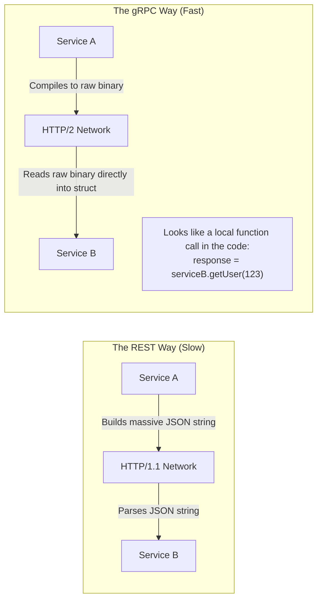

## Concept

For a decade, microservices communicated primarily using **REST APIs** over HTTP/1.1, passing JSON strings back and forth. JSON is human-readable, but it is bloated, slow to parse, and lacks strict typing.
**gRPC (gRPC Remote Procedure Calls)** was developed by Google to fix this. It is an ultra-fast, strictly typed, binary communication protocol built explicitly for server-to-server microservice communication.

## Mental Model



## How It Works

gRPC relies on two fundamental technologies:

**1. Protocol Buffers (Protobuf)**
Instead of JSON, you define your data structures and API endpoints in a `.proto` file (a strongly typed contract).
```protobuf
message UserRequest {
  int32 id = 1;
}
message UserResponse {
  string name = 1;
}
service UserService {
  rpc GetUser(UserRequest) returns (UserResponse);
}
```
You run a compiler tool that takes this `.proto` file and automatically generates the client and server code in whatever language you want (Node.js, Go, Python). When data is sent over the network, it is serialized into tiny, compressed binary packets.

**2. HTTP/2**
REST traditionally runs on HTTP/1.1. gRPC requires HTTP/2. This allows for:
- **Multiplexing:** Sending thousands of concurrent requests over a single TCP connection.
- **Bidirectional Streaming:** Both the client and server can stream an infinite flow of data back and forth simultaneously over the same connection.

## Trade-Offs

- **Pros:** 
  - **Speed:** Binary Protobufs serialize/deserialize 5x to 10x faster than JSON and consume less bandwidth.
  - **Strict Contracts:** Because both microservices use the exact same `.proto` file, it is impossible for Service A to send a string when Service B expects an integer. The code won't even compile. 
- **Cons:** 
  - **Not Human Readable:** You cannot use `curl` or Postman easily to test a gRPC endpoint because the payload is unreadable binary garbage. You have to use specialized tools (like `grpcurl`).
  - **Browser Support:** Browsers cannot natively speak raw HTTP/2 gRPC. You must use a proxy (like Envoy or gRPC-Web) to translate between the frontend and the gRPC backend.

## Real-World Usage

- **Internal Microservices:** gRPC is the absolute industry standard for internal, backend-to-backend communication. If the Auth Service needs to talk to the Payment Service, they use gRPC.
- **External APIs:** You generally still use REST or GraphQL for the public-facing API that Mobile Apps and Web Browsers talk to, because of the tooling ecosystem and ease of use.

## Interview Questions

**Q: Explain the 4 different streaming patterns available in gRPC.**
**A:** Because gRPC uses HTTP/2, it supports four distinct communication patterns:
1. **Unary:** The classic approach. Client sends 1 request, Server returns 1 response.
2. **Server Streaming:** Client sends 1 request, Server pushes a continuous stream of data back (like a stock ticker).
3. **Client Streaming:** Client uploads a continuous stream of data (like chunks of a large video file), Server waits until it's done and returns 1 response.
4. **Bidirectional Streaming:** Client and Server both send continuous streams of data to each other simultaneously over the same connection (like a real-time multiplayer game).

**Q: Why does Protobuf assign numbers to fields? (e.g., `string name = 1;`)**
**A:** This is for **Forward and Backward Compatibility**. In JSON, if you rename a key from `userName` to `name`, the downstream service breaks. In Protobuf, the binary payload doesn't actually send the string "name" over the network; it only sends the field tag `1`. As long as you never change the tag number `1`, you can rename the variable in your code, or old versions of the microservice can simply ignore new tags they don't understand, preventing the system from breaking during rolling deployments.
