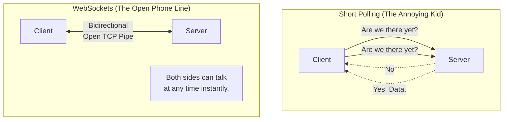

## Concept

HTTP is a request-response protocol. A client asks for data, the server responds, and the connection closes immediately. But what if you are building a chat application? If User B sends a message to the server, how does the server push that message to User A's browser, since the server cannot initiate an HTTP request? 
Historically, this was solved with **Polling**. Modern applications solve this with **WebSockets**.

## Mental Model

## The 3 Evolutionary Steps

### 1. Short Polling (AJAX Polling)
- **How it works:** The Javascript `setInterval` function fires an HTTP request every 5 seconds asking the server, "Any new messages?". The server replies with empty JSON if there are none.
- **Pros:** Incredibly easy to implement. Works over standard HTTP/REST.
- **Cons:** Brutally inefficient. If 10,000 users are chatting, your server receives 2,000 requests per second just to reply "Nothing new here." It destroys server CPU and wastes mobile battery life.

### 2. Long Polling
- **How it works:** The Client sends an HTTP request. If the Server has no new data, it *does not reply*. It holds the HTTP connection open indefinitely (e.g., for 30 seconds). The moment a new chat message arrives, the Server uses that hanging connection to push the data and close it. The Client instantly opens a new hanging connection.
- **Pros:** Eliminates the thousands of empty "No data" requests. Updates are instantaneous.
- **Cons:** Extremely taxing on server resources to hold thousands of HTTP threads open simultaneously. High latency to re-establish connections.

### 3. WebSockets
- **How it works:** A completely different protocol (`ws://` instead of `http://`). The Client sends an HTTP request to "Upgrade" to a WebSocket. The Server agrees. The HTTP connection is abandoned, and a raw, persistent, bidirectional TCP pipe is opened between the client and server.
- **Pros:** Perfect real-time communication. Low overhead (no HTTP headers are sent back and forth). Both client and server can push data to each other at any millisecond.
- **Cons:** Stateful. Load balancing WebSockets is notoriously difficult.

## Trade-Offs: The Load Balancing Nightmare

REST APIs are Stateless. A Load Balancer can send Request 1 to Server A, and Request 2 to Server B. 
WebSockets are **Stateful**. If User A opens a WebSocket to Server A, that specific TCP pipe lives ONLY on Server A. If User B opens a WebSocket to Server B and sends a chat message intended for User A, Server B has no idea where User A is. 
**The Fix:** You must connect all your WebSocket servers together using a Pub/Sub backplane (usually **Redis Pub/Sub**). Server B publishes the chat message to Redis. Server A receives it from Redis, realizes it holds the pipe for User A, and pushes it down the pipe.

## Real-World Usage

- **WebSockets:** Real-time multiplayer games, live financial trading tickers, collaborative editors (Figma/Google Docs), WhatsApp web.
- **Polling:** Status dashboards (checking if a video finished processing every 10 seconds). Do not use WebSockets for something that only updates every 5 minutes.

## Interview Questions

**Q: In a cloud environment like AWS, servers are automatically shut down (scaled in) when traffic drops. What is the danger of this if you are using WebSockets instead of standard REST HTTP?**
**A:** Since WebSockets are persistent, long-lived TCP connections, shutting down a server violently terminates all the active WebSocket connections attached to it. Thousands of clients will instantly disconnect and immediately try to reconnect, potentially causing a "Thundering Herd" DDoS attack on your surviving servers. Standard stateless HTTP requests finish in milliseconds, so a server can safely shut down without interrupting users. To fix this with WebSockets, you must implement graceful degradation (sending a custom control message down the pipe telling clients to disconnect and slowly reconnect over a randomized backoff period before terminating the server).
