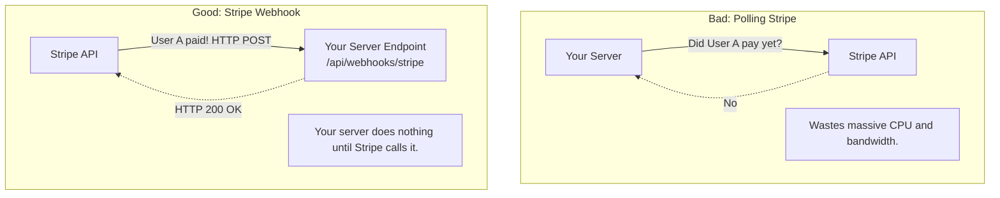

## Concept

WebSockets and SSE are used to push real-time data from a Server to a *Client's Browser*. But what if a 3rd-party Server (like Stripe) needs to push real-time data to *your* Server (like your Payment API)? 
They cannot use WebSockets. Instead, they use **Webhooks**. A Webhook is simply a user-defined HTTP POST callback. It is the internet's standard way for two independent backend systems to notify each other of events.

## Mental Model

## How It Works

1. **The Registration:** You log into the Stripe Developer Dashboard. You paste a URL belonging to your server (e.g., `https://api.mycorp.com/stripe-webhook`).
2. **The Event:** A user pays for an item on Stripe's checkout page.
3. **The Push:** Stripe's backend generates a massive JSON payload containing the receipt data. Stripe acts as the *Client* and makes an HTTP POST request to the URL you provided.
4. **The Acknowledgement:** Your server receives the POST, parses the JSON, updates your internal database to mark the user as "Paid", and *must* respond with an HTTP `200 OK`.
5. **The Retries:** If your server is offline and returns a `500 Error`, Stripe will automatically queue the Webhook and retry sending it later (using an Exponential Backoff strategy) until you finally acknowledge it.

## Trade-Offs

- **Pros:** Massive efficiency gain over API polling. Perfect for server-to-server asynchronous event notification.
- **Cons:** 
  - Your webhook endpoint must be exposed to the public internet.
  - Requires complex security verification.
  - Hard to test locally (you have to use tools like `ngrok` to expose your `localhost` to the internet so Stripe can hit it).

## Real-World Usage

- **Stripe / PayPal:** Notifying your backend when a payment succeeds or fails.
- **GitHub:** Triggering your Jenkins CI/CD pipeline server exactly 1 second after a developer pushes code to the `main` branch.
- **Slack Bots:** When a user types `/weather` in Slack, Slack's servers fire a Webhook to your backend server containing the user's text.

## Interview Questions

**Q: Because your Webhook URL (`/api/webhooks/stripe`) is exposed to the public internet, a malicious attacker discovers it and starts sending fake HTTP POST requests saying "User 123 has paid $1,000,000." Your system blindly upgrades their account. How do you secure a Webhook endpoint?**
**A:** You must verify the **Cryptographic Signature**. 
When you register your URL with Stripe, Stripe gives you a Secret Key. When Stripe sends a Webhook, it hashes the JSON payload using that Secret Key and attaches the resulting hash string to the `Stripe-Signature` HTTP Header.
When your server receives the request, it takes the raw JSON body and hashes it using your copy of the Secret Key. If your calculated hash perfectly matches the hash in the HTTP Header, you know with 100% mathematical certainty that the request genuinely came from Stripe and the payload was not tampered with. You reject any requests where the signatures don't match.

**Q: Why is it a terrible idea to process the video compression directly inside the Webhook endpoint handler?**
**A:** Webhook providers (like Stripe or GitHub) have strict timeouts (usually 3 to 10 seconds). If they don't receive an HTTP `200 OK` from you within that time, they assume your server crashed, close the connection, and queue a Retry. 
If you try to compress a video synchronously inside the endpoint, it will take 5 minutes. The provider will timeout, retry, and you will end up compressing the same video 50 times simultaneously. 
**Fix:** The Webhook endpoint should simply parse the JSON, drop the message into an internal Message Queue (like RabbitMQ), and instantly return `200 OK`. A background worker will read the queue and compress the video later.
