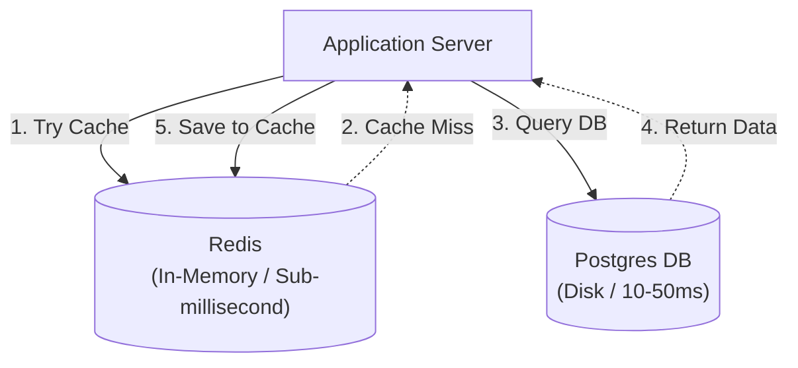

## TL;DR

Redis (Remote Dictionary Server) is an open-source, incredibly fast, in-memory key-value data store. It is primarily used as a cache to sit in front of slow relational databases, but also acts as a message broker, session store, and leaderboard engine.

## Mental Model

## Why is Redis so fast?

1. **In-Memory**: It stores all data in RAM, completely bypassing slow disk I/O.
2. **Single-Threaded Architecture**: Redis uses a single event loop to process commands sequentially. This completely eliminates context switching, deadlocks, and the need for complex thread locks (mutexes).

## Advanced Data Structures

Unlike Memcached (which only stores strings), Redis natively understands complex data structures, allowing it to perform atomic operations on them incredibly fast:

1. **Strings**: Simple key-value (cache HTML, JSON).
2. **Hashes**: Maps of fields to values (great for storing User objects).
3. **Lists**: Linked lists. (`LPUSH`, `RPOP`). Great for simple message queues or activity feeds.
4. **Sets**: Unordered collections of unique strings. (`SADD`, `SISMEMBER`). Great for tags or checking if an item exists.
5. **Sorted Sets (ZSET)**: Sets ordered by a "score". (`ZADD`). **The ultimate tool for building live Leaderboards or Rate Limiters**.

## Interview Questions

### Since Redis is entirely in-memory, what happens if the server crashes? Is data lost?
By default, Redis loses data on restart. However, it can be configured for persistence:
- **RDB (Redis Database Backup)**: Takes point-in-time snapshots of the dataset at specified intervals and saves them to disk.
- **AOF (Append Only File)**: Logs every single write operation received by the server to a disk file. Safer, but slower and uses more disk space.

### If Redis is single-threaded, how does it handle high concurrency?
It uses **I/O Multiplexing** (epoll/kqueue) to handle thousands of connections simultaneously on that single thread. Because the data is in RAM, operations execute in microseconds, allowing that single thread to process millions of requests per second before becoming a bottleneck.

## Common Gotchas

*   **The `KEYS *` Command**: Never run `KEYS *` (fetch all keys) in a production Redis instance. Because Redis is single-threaded, scanning millions of keys will block the entire thread, bringing your entire application to a halt. Use the iterative `SCAN` command instead.

## Remember

> Redis is the "Swiss Army Knife" of System Design. Need a cache? Redis. Need a rate limiter? Redis. Need a queue? Redis. Need a pub/sub channel? Redis.
