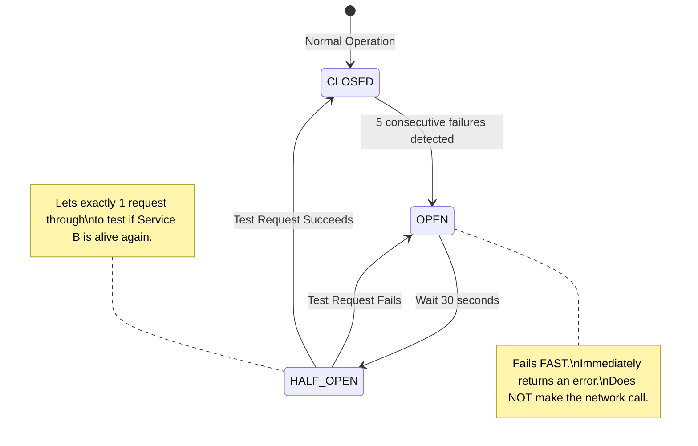

## Concept

In a microservices architecture, Service A calls Service B synchronously over HTTP. What happens if Service B goes down?
If Service A tries to connect, the request will hang until the 30-second network timeout is reached. If Service A receives 1,000 requests per second from users, it will quickly open 30,000 pending HTTP connections waiting for Service B. Service A will run out of RAM and threads, and it will crash too. This is a **Cascading Failure**, where one dead service drags down the entire company.
The **Circuit Breaker Pattern** prevents this by detecting the failure and instantly "tripping," cutting off the connection to save Service A.

## Mental Model

## The 3 States of a Circuit Breaker

The Circuit Breaker wraps the HTTP call in a protective software layer (often implemented via a Service Mesh like Istio, or a library like Resilience4j/Hystrix).

**1. CLOSED (Green Light):**
Everything is fine. Service A sends HTTP requests to Service B normally. The Circuit Breaker monitors the success/failure rate.

**2. OPEN (Red Light):**
If Service B returns 5 errors in a row (or latency spikes to 10 seconds), the Circuit Breaker "Trips" to the OPEN state.
For the next 30 seconds, if Service A tries to call Service B, the Circuit Breaker intercepts it and instantly returns a predefined Fallback Error in 1 millisecond. It *does not* forward the request over the network. 
- **Benefit 1:** Service A's threads are freed up instantly, saving it from crashing.
- **Benefit 2:** Service B is completely shielded from traffic, giving it the breathing room to reboot and recover without being hammered by retries.

**3. HALF-OPEN (Yellow Light):**
After the 30-second timeout, the Circuit Breaker tentatively shifts to HALF-OPEN. It allows *exactly one* request to pass through to Service B.
- If it succeeds, the Circuit Breaker resets to CLOSED.
- If it fails, the Circuit Breaker immediately snaps back to OPEN and waits another 30 seconds.

## Real-World Usage

Circuit Breakers are intimately tied to **Graceful Degradation** in UX design.
If the Recommendation Service goes down, the Circuit Breaker opens. Instead of throwing a 500 error to the user, the Circuit Breaker's Fallback function instantly returns an empty array `[]` (or a hardcoded list of top 10 movies). The Netflix UI renders perfectly, and the user never even realizes the backend is melting down.

## Interview Questions

**Q: In an Event-Driven Architecture using Kafka, do you need to implement Circuit Breakers?**
**A:** **Generally, No.** Circuit Breakers are designed specifically to protect against the dangers of *Synchronous* blocking calls (HTTP/gRPC). If you are using asynchronous message queues or Kafka, the Producer (Service A) is completely decoupled. It just drops the event into Kafka and returns immediately. If the Consumer (Service B) is dead, Kafka acts as a massive shock absorber, holding the messages safely until Service B wakes up. The thread exhaustion problem does not exist.

**Q: Explain the difference between a Circuit Breaker and an API Rate Limiter.**
**A:** 
- A **Rate Limiter** protects a service from receiving *too much inbound traffic* from a specific user. It drops traffic at the front door.
- A **Circuit Breaker** protects a service from *its own outbound network calls*. It stops a service from wasting time and memory calling another downstream service that is known to be dead.
