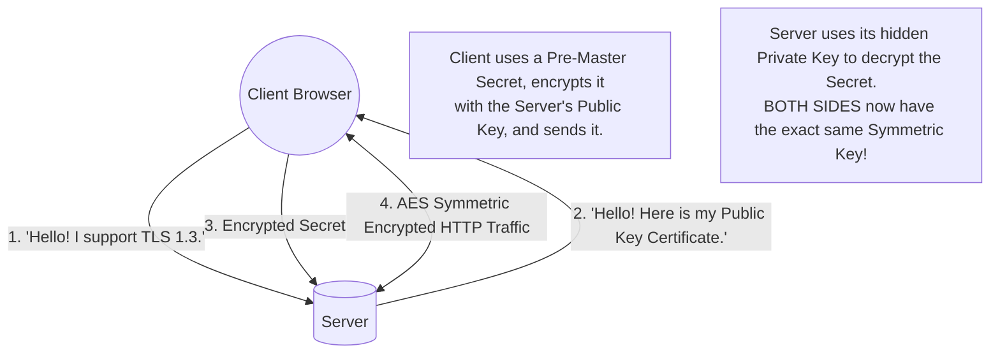

## Concept

If you send a password over standard HTTP, it travels across the internet in plain text. Any router, ISP, or hacker sitting between you and the server can read the raw packets and steal your password (a Man-in-the-Middle attack).
**HTTPS** (Hypertext Transfer Protocol Secure) solves this by wrapping the HTTP data in an encrypted tunnel using the **TLS** (Transport Layer Security) protocol.

## The Problem with Encryption

To encrypt data, both the Client and the Server need an Encryption Key. 
- **Symmetric Encryption (AES):** Uses the *same* key to lock and unlock the data. It's incredibly fast, but how do you securely send the key to the Server over the public internet without a hacker stealing it?
- **Asymmetric Encryption (RSA):** Uses *two* keys. A Public Key (shared with the world) that can only lock data, and a Private Key (kept secretly on the server) that can only unlock data. It solves the key-sharing problem but is mathematically extremely slow—too slow to stream a Netflix video.

**The Solution:** TLS uses *both*. It uses slow Asymmetric encryption just once to securely exchange a temporary key, and then switches to fast Symmetric encryption for the rest of the conversation.

## The TLS Handshake (Mental Model)

## Certificate Authorities (CA)

How does the Client know the Public Key it received actually belongs to `google.com` and not a hacker spoofing the DNS?
The Server must provide an **SSL/TLS Certificate**. This certificate is digitally signed by a highly trusted third party known as a **Certificate Authority (CA)** (e.g., Let's Encrypt, DigiCert). 
Your browser comes pre-installed with the root certificates of these trusted CAs. When the Server hands the browser its certificate, the browser verifies the CA's cryptographic signature. If the signature is valid, the browser trusts that the server is legitimately `google.com`.

## SSL Termination in System Design

In a microservices architecture, forcing every internal Node.js server to handle complex TLS handshakes and decrypt AES traffic wastes massive amounts of CPU.
Instead, System Designers use **SSL Termination** (or TLS Offloading). 
1. The Load Balancer or API Gateway handles the TLS Handshake and decrypts the traffic using its powerful hardware.
2. The Load Balancer then forwards the raw, unencrypted HTTP data to the internal microservices over the secure, private internal network (VPC). 
3. This centralizes certificate management to one single server.

## Interview Questions

**Q: What is mTLS (Mutual TLS) and why is it required in modern Service Meshes?**
**A:** Standard TLS only authenticates the Server to the Client (your browser knows the server is Google). It does not authenticate the Client. 
In a "Zero Trust" internal microservices network, **Mutual TLS** requires both sides to present certificates. The Payment Service mathematically proves its identity to the Database, AND the Database mathematically proves its identity to the Payment Service. If a hacker breaches the network and tries to query the Database, the Database rejects the connection because the hacker doesn't possess a valid internal TLS certificate.

**Q: A developer accidentally commits the company's Private TLS Key to a public GitHub repository. What is the immediate danger, and how does Forward Secrecy mitigate past damage?**
**A:** The immediate danger is that anyone who holds the Private Key can spoof your domain or perform a Man-in-the-Middle attack, decrypting all *future* traffic. You must instantly revoke the certificate and issue a new one.
Historically, if a hacker recorded 5 years of your encrypted traffic, stealing the Private Key today would allow them to decrypt all that past data. Modern TLS 1.3 uses **Perfect Forward Secrecy (PFS)** via the Diffie-Hellman algorithm. PFS generates a completely unique, temporary symmetric key for *every single session*, and never sends it over the wire. Therefore, even if the main Server Private Key is compromised, past recorded traffic remains mathematically impossible to decrypt.
