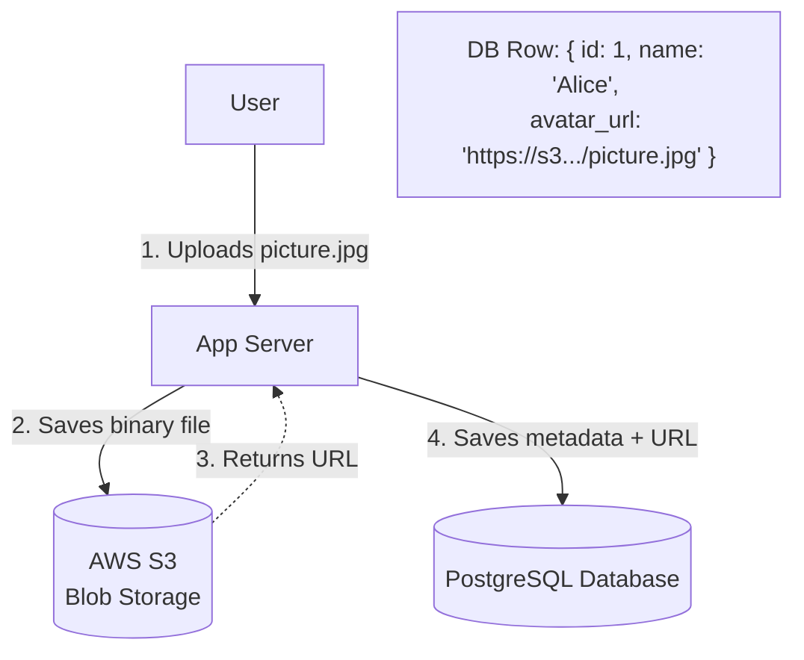

## Concept

"BLOB" stands for **Binary Large Object**. It refers to massive, unstructured data files—images, MP4 videos, PDF documents, or compiled application binaries. In System Design, you never store Blob data directly inside a relational SQL database. Instead, you use dedicated **Object Storage** systems (like AWS S3).

## Mental Model

## How It Works

**The Golden Rule:** Never store a file in a database.
If you store a 5MB image directly in a PostgreSQL `BYTEA` column, your database will quickly swell to Terabytes in size. Database RAM (the Buffer Pool) is designed to cache frequently accessed tabular data. If a user queries the image, PostgreSQL will load the 5MB image into RAM, evicting thousands of highly valuable cached user rows just to make room for one picture. Performance will collapse.

**The Solution:**
1. The user uploads the file to the App Server.
2. The App Server validates the file, generates a unique UUID filename, and uploads the raw binary file to Blob Storage (S3).
3. S3 returns a URL string (e.g., `s3.amazonaws.com/bucket/123.jpg`).
4. The App Server saves that simple text URL string into the PostgreSQL database.

## Advanced: Pre-Signed URLs (Direct Upload)

The flow above has a massive flaw: If 1,000 users upload 1GB videos simultaneously, your App Server's bandwidth will saturate, its RAM will fill up, and it will crash.

To fix this, we bypass the App Server entirely using **Pre-Signed URLs**:
1. User clicks "Upload". The client asks the App Server for permission.
2. The App Server uses its secret AWS keys to generate a temporary, cryptographically signed URL valid for exactly 5 minutes, and returns it to the client.
3. The Client's browser uses that URL to upload the 1GB video *directly* to AWS S3. The App Server's bandwidth is completely untouched.

## Real-World Usage

- **AWS S3 / Google Cloud Storage:** The industry standard.
- **Data Lakes:** Companies dump billions of raw JSON log files into Blob Storage. Because S3 is so cheap, it is the foundation of "Big Data" analytics (using tools like AWS Athena to run SQL queries directly against text files stored in S3).

## Interview Questions

**Q: You are building YouTube. A user uploads a video using a Pre-Signed URL directly to S3. How does your backend database know the upload finished successfully so it can publish the video?**
**A:** Since the upload bypassed our App Server, we must use Event-Driven Architecture. AWS S3 can be configured to emit an **Event Notification** the exact moment a file finishes uploading. S3 sends a message to a queue (AWS SQS) or triggers a Serverless Function (AWS Lambda). That Lambda function then connects to our PostgreSQL database and updates the video status to "Uploaded", triggering the video encoding pipeline.
