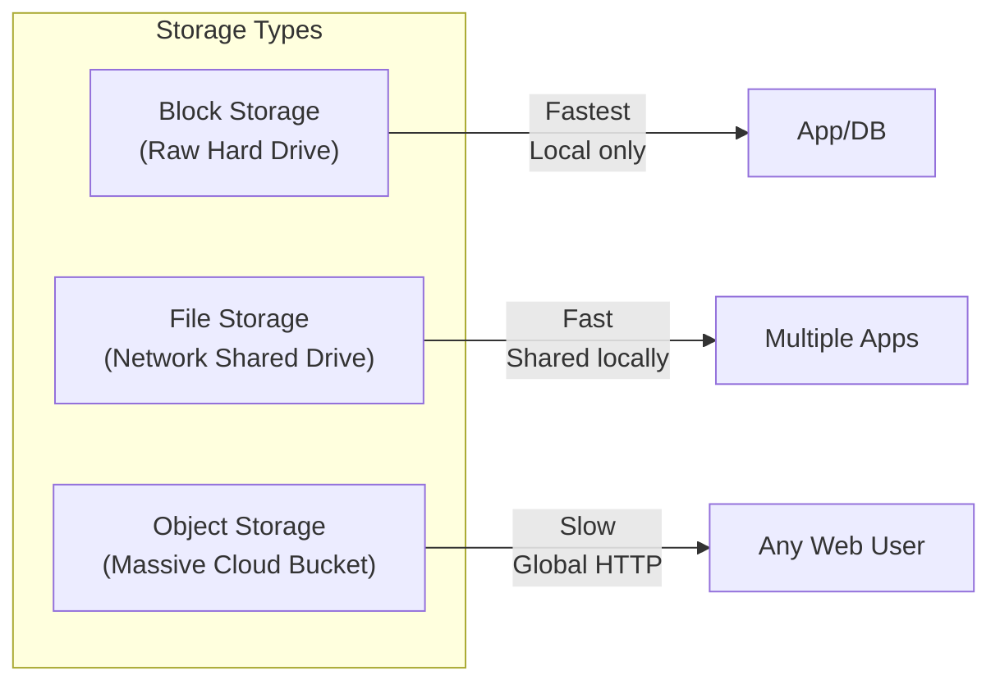

## Concept

When you provision a server in the cloud, you need to attach storage to it. There are three fundamentally different ways computers structure and access data on physical disks. Choosing the wrong one will either crash your database or bankrupt your company.

## Mental Model

## 1. Block Storage
Think of Block Storage as a raw, physical hard drive (SSD/HDD) plugged directly into your server's motherboard. 
- **How it works:** Data is chopped into perfectly equal-sized blocks (e.g., 4KB) with no metadata. The Operating System manages it directly.
- **Pros:** **Absolute lowest latency.** You can install an Operating System on it. You can format it with any file system (ext4, NTFS).
- **Cons:** It is physically tethered to ONE server. It cannot be easily shared.
- **Use Case:** Relational Databases (PostgreSQL, Oracle). Databases require hyper-fast, byte-level modifications.
- **AWS Equivalent:** EBS (Elastic Block Store).

## 2. File Storage
Think of File Storage as a shared folder on your company's internal network (NAS).
- **How it works:** Data is organized in a hierarchy of folders and files (e.g., `/var/www/images/cat.png`). 
- **Pros:** Multiple servers can mount the same drive and read/write to it simultaneously.
- **Cons:** Slower than Block Storage because of the network and file system overhead.
- **Use Case:** Legacy CMS applications (like old WordPress) where multiple web servers need to read the exact same uploaded images folder.
- **AWS Equivalent:** EFS (Elastic File System).

## 3. Object Storage
Think of Object Storage as an infinite bucket accessed via the internet.
- **How it works:** There are no folders. Data is stored as an "Object" consisting of the raw data, massive amounts of custom metadata, and a globally unique URL.
- **Pros:** **Infinite scalability.** You can store 50 Petabytes of videos without ever provisioning a hard drive. It is incredibly cheap.
- **Cons:** **No partial updates.** If you have a 10GB video file and want to change 1 byte, you cannot just modify the block (like in Block Storage). You must re-upload the entire 10GB file. You cannot run a database on it.
- **Use Case:** User uploads, profile pictures, video streaming, database backups.
- **AWS Equivalent:** S3 (Simple Storage Service).

## Interview Questions

**Q: You are building a new Netflix competitor. Where do you store the thousands of MP4 video files?**
**A:** I would use **Object Storage (AWS S3)**. Video files are massive, unstructured data that are written once and read millions of times. Block storage is too expensive and cannot scale to Petabytes easily. Furthermore, Object Storage integrates directly with CDNs (like CloudFront), allowing users to stream the videos globally via HTTP URLs.

**Q: A developer suggests moving the PostgreSQL database files onto Object Storage (S3) to save money. Why is this a terrible idea?**
**A:** A database constantly updates tiny fragments of files (e.g., changing a user's balance from $10 to $20). Object Storage does not support partial file modifications; you would have to download the entire multi-gigabyte database file, change the single byte, and re-upload the whole file for every single SQL query. It would take minutes per query. Databases require the low-latency, byte-level mutation capabilities of **Block Storage**.
