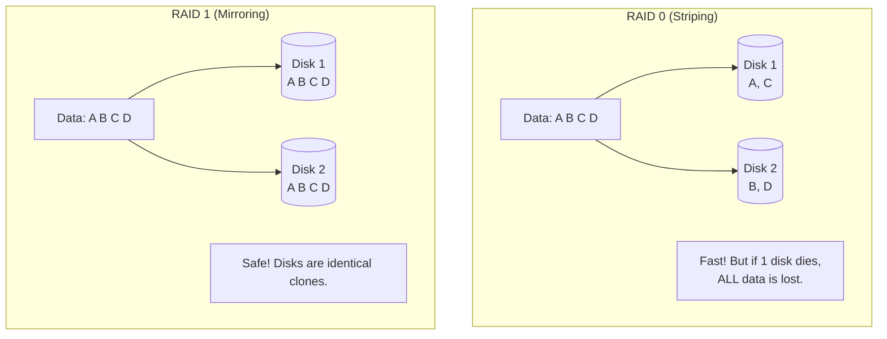

## Concept

Hard drives fail. It is a physical certainty. If your database server has a single hard drive and it dies, your system crashes and data is lost.
**RAID (Redundant Array of Independent Disks)** is a technology that connects multiple physical hard drives together so the Operating System sees them as one single, massive drive. Depending on the RAID configuration, you gain massive read/write speed, protection against hardware failure, or both.

## Mental Model

## The Primary RAID Levels

### RAID 0 (Striping)
- **How it works:** Data is split into pieces. Half is written to Disk A, half to Disk B.
- **Pros:** 2x Read and Write speed (because both disks work simultaneously).
- **Cons:** Zero redundancy. If either disk fails, the data on the surviving disk is completely useless.
- **Use Case:** Temporary caches, video editing scratch disks. Never use for a database.

### RAID 1 (Mirroring)
- **How it works:** Every piece of data is written to Disk A and perfectly cloned to Disk B.
- **Pros:** Perfect redundancy. If Disk A bursts into flames, the server keeps running seamlessly using Disk B. Read speeds are 2x faster (you can read from both).
- **Cons:** You buy 2TB of hard drives, but only get 1TB of usable space. Write speeds are slightly slower.
- **Use Case:** Operating System drives, standard database servers.

### RAID 5 (Striping with Parity)
- **How it works:** Requires at least 3 disks. Data is striped across them, but a mathematical "Parity" block is also calculated and saved. 
- **Pros:** If *any single disk* fails, the RAID controller uses the math from the surviving disks to perfectly reconstruct the missing data. You get speed + safety + better storage efficiency than RAID 1.
- **Cons:** Rebuilding a dead 10TB drive takes days, and if a second drive dies during the rebuild, everything is lost.

### RAID 10 (1+0)
- **How it works:** A combination. It requires 4 disks. It stripes the data for speed (RAID 0), and then mirrors those stripes for safety (RAID 1).
- **Pros:** The ultimate combination of High Speed and High Redundancy. It can survive multiple disk failures.
- **Cons:** Extremely expensive. You lose 50% of your total purchased storage capacity.
- **Use Case:** High-performance, enterprise SQL databases.

## Real-World Usage

In the modern Cloud Era (AWS/GCP), you rarely configure RAID arrays manually. When you provision an AWS EBS (Elastic Block Store) volume, AWS is secretly running a massive, proprietary RAID-like distributed storage system behind the scenes to guarantee 99.999% durability. However, understanding RAID is still a fundamental concept for understanding distributed database sharding and replication logic.

## Interview Questions

**Q: If I use RAID 1 (Mirroring) on my database server, do I still need to perform daily database backups?**
**A:** **YES!** RAID is NOT a backup. RAID only protects against *hardware failure*. If a junior developer accidentally runs `DROP TABLE users;`, RAID 1 will flawlessly and instantly mirror that deletion to the second hard drive, destroying your data permanently. You must still take periodic snapshots or backups to protect against human error and software bugs.
