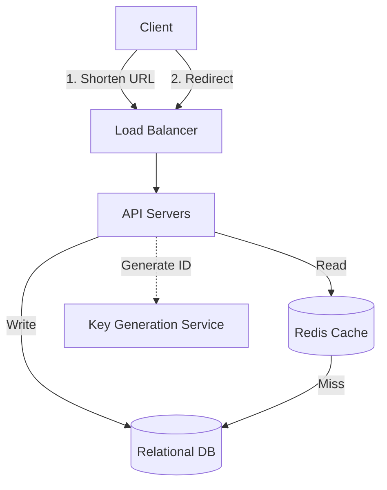

## 1. Requirements

**Functional:**
1. Given a long URL, return a short URL.
2. Given a short URL, redirect to the original long URL.
3. (Optional) Custom short URLs.
4. (Optional) Analytics on clicks.

**Non-Functional:**
1. Highly available (redirects must never fail).
2. Low latency for redirects.
3. Not guessable (for security/privacy).
4. Scalable to millions of URLs.

## 2. Capacity Estimation

*   **Traffic:** 100M new URLs/month, 10B redirects/month (100:1 read/write ratio).
*   **Write QPS:** ~40/sec.
*   **Read QPS:** ~4,000/sec.
*   **Storage:** 100M * 10 years * 500 bytes = ~500 GB.
*   **Memory (Cache):** Cache 20% of requests (80/20 rule). 10B * 20% / 30 days = ~66M requests/day * 500 bytes = ~33GB memory.

## 3. High-Level Architecture

## 4. Core Components

### The Key Generation Service (KGS)
Instead of generating hashes on the fly and checking the DB for collisions, we pre-generate random 7-character strings (Base62) and store them in a standalone service/database.
- **Base62:** `[A-Z, a-z, 0-9]` gives 62 characters. $62^7 = 3.5$ trillion possibilities.
- The API simply requests an unused key from KGS and assigns it.

### Database
- We can use a Relational DB (PostgreSQL) or NoSQL (Cassandra).
- Since data is highly relational (User -> URLs) and we need ACID guarantees for billing/analytics, PostgreSQL is a solid choice. If scale is massive, DynamoDB/Cassandra with the Short URL as the Partition Key works great.

### Caching
- **Redis/Memcached**: Crucial for redirect performance. 
- Use an LRU (Least Recently Used) eviction policy.

## 5. Trade-offs & Interview Questions

### Why not use an MD5 hash of the URL?
1. **Collisions**: MD5 could result in collisions for two different long URLs.
2. **Same URL, Different Users**: If two users shorten the same URL, we usually want two different short URLs for tracking. Hashing the URL directly prevents this. KGS solves this.

### How do you handle 301 vs 302 redirects?
- **301 (Permanent)**: Better for SEO, but the browser caches it, meaning our analytics server won't see repeat clicks.
- **302 (Temporary)**: Every click goes to our server first. Better for analytics, slightly worse for latency.

## 💡 Remember

> A Key Generation Service (KGS) prevents collisions and reduces write latency by decoupling ID generation from the main request path.
