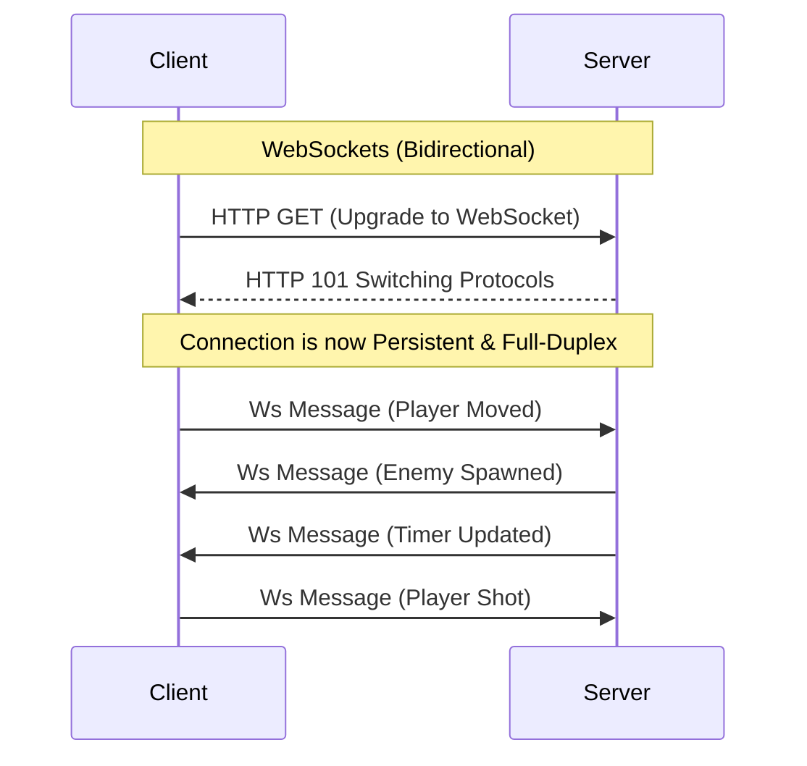

## TL;DR

HTTP is strictly request-response (the client must ask for data). To push real-time data from the server to the client (like a chat app or live sports scores), you must use Short Polling, Long Polling, Server-Sent Events (SSE), or WebSockets.

## 1. Short Polling
The client repeatedly sends an HTTP request to the server every $X$ seconds asking, "Do you have new data?".
- **Pros**: Extremely simple to implement.
- **Cons**: Massive waste of resources. 99% of requests return empty, overwhelming the server with useless HTTP connection overhead.

## 2. Long Polling
The client sends an HTTP request. If the server has no new data, it **holds the connection open** (doesn't reply) until new data arrives or a timeout occurs. Once the client receives the response, it immediately opens a new Long Polling request.
- **Pros**: Data arrives instantly without wasted empty requests. Works over standard HTTP/1.1.
- **Cons**: If data updates very frequently, it degrades back into Short Polling (constantly closing and reopening connections). 

## 3. Server-Sent Events (SSE)
A one-way, persistent HTTP connection. The client connects once, and the server continuously streams data down to the client as events occur.
- **Pros**: Built-in browser API (`EventSource`). Automatically handles reconnections. Uses standard HTTP.
- **Cons**: **Strictly Unidirectional** (Server -> Client). The client cannot send data back over this connection. Limited to 6 concurrent connections per browser.
- **Use Case**: Live sports scores, stock tickers, Twitter feeds.

## 4. WebSockets
A persistent, **bidirectional**, full-duplex TCP connection. After an initial HTTP handshake, the protocol upgrades to WebSockets (`ws://`). Both the client and server can send messages to each other at any time, instantly.
- **Pros**: Ultra-low latency. True two-way communication. Minimal packet overhead (no HTTP headers sent with every message).
- **Cons**: Difficult to scale. Load balancers must hold millions of stateful TCP connections open. Doesn't use standard HTTP caching or routing.
- **Use Case**: Multiplayer games, live collaborative editing (Figma, Google Docs), WhatsApp web.

## Mental Model

## Interview Questions

### How do you scale WebSockets horizontally?
Scaling stateless HTTP servers is easy (just add a Load Balancer). Scaling WebSockets is hard because connections are stateful.
If User A is connected to Server 1, and User B is connected to Server 2, how do they chat?
**Solution**: Use a pub/sub message broker like **Redis Pub/Sub**. When User A sends a message to Server 1, Server 1 publishes the message to Redis. Server 2 subscribes to Redis, receives the message, and pushes it down the WebSocket to User B.

## Remember

> Don't default to WebSockets for everything. If you only need one-way data (Server to Client), SSE is much simpler and easier to scale.
