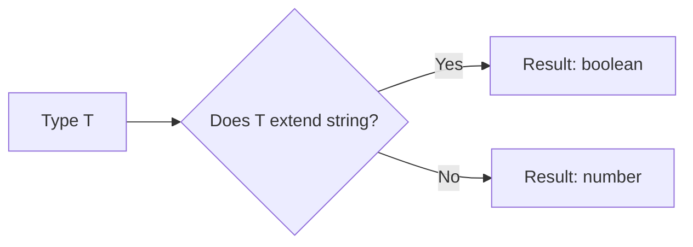

## TL;DR

**Conditional Types** allow you to write logic in your types using a ternary operator syntax (`condition ? true : false`). They take the form `SomeType extends OtherType ? TrueType : FalseType`.

## Mental Model



## How It Works

Just like a JavaScript ternary operator makes decisions based on values, a conditional type makes decisions based on types. 
The `extends` keyword here acts as an "is assignable to" check. 

Conditional types are incredibly powerful when combined with Generics, allowing a function's return type to change dynamically based on the exact type of the argument provided.

## Example

```typescript
// A basic conditional type
type IsString<T> = T extends string ? "YES" : "NO";

type A = IsString<"hello">; // Evaluates to "YES"
type B = IsString<42>;      // Evaluates to "NO"

// --- PRACTICAL EXAMPLE ---
interface IdLabel { id: number; }
interface NameLabel { name: string; }

// If T is a number, return an IdLabel. Otherwise, return a NameLabel.
type NameOrId<T extends number | string> = T extends number ? IdLabel : NameLabel;

function createLabel<T extends number | string>(idOrName: T): NameOrId<T> {
    throw "unimplemented";
}

const label1 = createLabel("typescript"); // TS knows label1 is NameLabel
const label2 = createLabel(2.8);          // TS knows label2 is IdLabel
```

## Common Interview Questions

### What are Distributive Conditional Types?
When you plug a Union Type into a conditional type, TypeScript automatically distributes the condition across every member of the union independently.
If you have `type ToArray<T> = T extends any ? T[] : never;`
And you pass `ToArray<string | number>`, it doesn't return `(string | number)[]`. 
It distributes and returns `string[] | number[]`.

### How do you prevent a Conditional Type from distributing?
If you want to evaluate the union as a whole, you wrap both sides of the `extends` keyword in square brackets:
`type ToArrayNonDist<T> = [T] extends [any] ? T[] : never;`
Now `ToArrayNonDist<string | number>` returns `(string | number)[]`.
