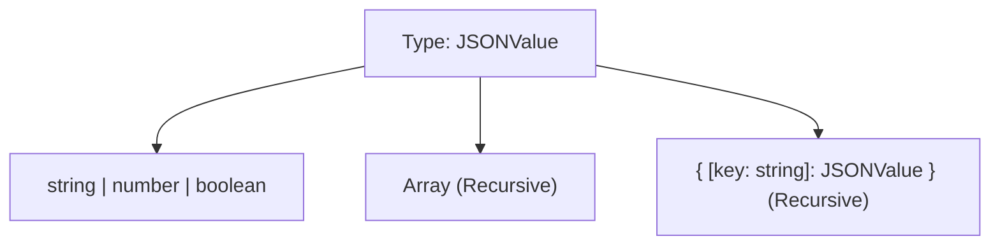

## TL;DR

A **Recursive Type** is a type that references itself in its own definition. This is necessary for modeling data structures that have an unknown or infinite level of nesting, such as JSON objects, DOM trees, or linked lists.

## Mental Model



## How It Works

Historically, creating recursive types in TypeScript was difficult and required specific `interface` workarounds. Since TypeScript 3.7, you can write recursive `type` aliases natively without any tricks, making it very easy to define nested structures.

## Example

```typescript
// 1. Defining a Linked List
type LinkedList<T> = {
    value: T;
    next: LinkedList<T> | null; // References itself!
};

const node1: LinkedList<number> = {
    value: 1,
    next: {
        value: 2,
        next: null
    }
};

// 2. Defining any valid JSON object
type JSONValue = 
    | string 
    | number 
    | boolean 
    | null 
    | JSONValue[] 
    | { [key: string]: JSONValue };

const myData: JSONValue = {
    user: "Alice",
    metadata: {
        tags: ["admin", "staff"],
        active: true
    }
};
```

## Common Interview Questions

### Can you use recursive types to deeply make all properties of an object optional?
Yes! You can combine a Recursive Type with a Mapped Type to create a `DeepPartial` utility.
```typescript
type DeepPartial<T> = {
    // If the property is an object, recursively call DeepPartial on it!
    [P in keyof T]?: T[P] extends object ? DeepPartial<T[P]> : T[P];
};
```

### What is the limit of recursion in TypeScript?
TypeScript has a hard-coded recursion depth limit (usually around 50-100 levels) to prevent the compiler from entering an infinite loop and crashing your IDE. If you hit this limit (often seen when doing complex type-level programming or math), you'll get the error: *"Type instantiation is excessively deep and possibly infinite."*
