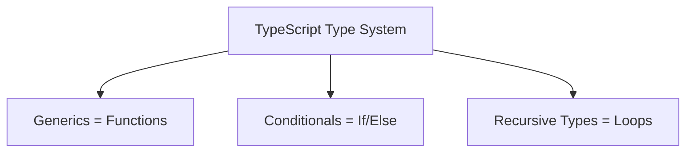

## TL;DR

The TypeScript type system is surprisingly powerful—it is actually a **Turing-complete** language on its own. This means you can write algorithms (like addition, loops, or parsing) entirely within the type system, executed by the compiler, without outputting any JavaScript.

## Mental Model



## How It Works

Type-level programming is rarely used in application code, but it is heavily used by authors of complex libraries (like Prisma, tRPC, or Zod) to provide a magical autocomplete experience.

- **Variables**: Generic parameters (`<T>`) act as variables.
- **If/Else**: Conditional types (`T extends U ? True : False`) act as logic gates.
- **Loops**: Recursive types act as loops, iterating over tuples or strings.
- **Math**: Since TS 4.8, you can actually perform basic math by manipulating the lengths of tuple types!

## Example: Building a Type-Level String Splitter

```typescript
// A generic that takes a string S, and a delimiter D, and returns an Array of strings.
type Split<S extends string, D extends string> = 
    string extends S ? string[] : // Safety check
    S extends '' ? [] : // Base case: empty string
    S extends `${infer T}${D}${infer U}` // If the string matches "Part1 + Delim + Part2"
        ? [T, ...Split<U, D>]            // Put Part1 in array, and recursively Split Part2
        : [S];                           // No delimiter found, return whole string in array

// --- USAGE ---
// The TS compiler calculates this array type completely at compile time!
type PathSegments = Split<"/users/123/profile", "/">; 
// Evaluates to: ["", "users", "123", "profile"]
```

## Common Interview Questions

### Should I write type-level algorithms in production code?
Almost never. It makes the codebase impossible to read for junior developers, massively slows down the compilation speed (and IDE responsiveness), and is prone to hitting the "excessively deep recursion" limit. Reserve this for utility libraries or extreme edge cases where type safety is paramount.

### Why is it said that TypeScript is Turing Complete?
In 2017, a GitHub issue proved that you can write a working Conway's Game of Life purely using TypeScript types. Because it supports conditional branching and unbounded recursion (simulating a "While" loop), it technically has the computational power to simulate a Turing machine.
