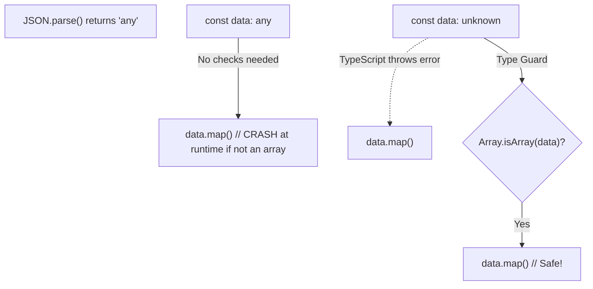

## TL;DR

- **`any`**: Turns off type checking. You can do whatever you want with the variable, and the compiler won't complain (even if it causes runtime crashes).
- **`unknown`**: A type-safe counterpart to `any`. It accepts any value, but **you cannot do anything with it** (like call methods or assign it to other variables) until you do a type check to narrow it down.

## Mental Model



## Example

```typescript
// --- ANY (Dangerous) ---
let dangerousValue: any = "hello";
dangerousValue.toPrecision(3); // No compile error! Will crash at runtime.

// --- UNKNOWN (Safe) ---
let safeValue: unknown = "hello";

// safeValue.toUpperCase(); // Compile Error! "Object is of type 'unknown'"

// You MUST narrow it down first (Type Guard)
if (typeof safeValue === "string") {
    console.log(safeValue.toUpperCase()); // Allowed! TypeScript knows it's a string.
}
```

## Interview Questions

### When should you use `any`?
Ideally, **never**. `any` defeats the entire purpose of using TypeScript. However, it is sometimes used temporarily when migrating massive legacy JavaScript codebases to TypeScript, or when dealing with highly dynamic, impossible-to-type third-party libraries.

### When should you use `unknown`?
When you are receiving data from an external source and you genuinely don't know what it is yet.
1. Return type of `JSON.parse()` (which returns `any` by default, but casting to `unknown` is safer).
2. The `error` object in a `catch` block (as of TS 4.4, thrown errors are `unknown` by default because JS can throw strings, numbers, or Error objects).

```typescript
try {
    throw "Just a string error";
} catch (error: unknown) {
    if (error instanceof Error) {
        console.log(error.message);
    } else if (typeof error === "string") {
        console.log(error);
    }
}
```

## Common Gotchas

*   **Assignability**: You can assign an `any` value to a strictly typed variable (e.g., `let num: number = myAnyVar`), which contaminates your type safety. You **cannot** assign an `unknown` value to a strict variable without narrowing it first.

## Remember

> `any` says "Trust me, I know what I'm doing, turn off the safety." 
> `unknown` says "I don't know what this is yet, force me to check before I use it."
