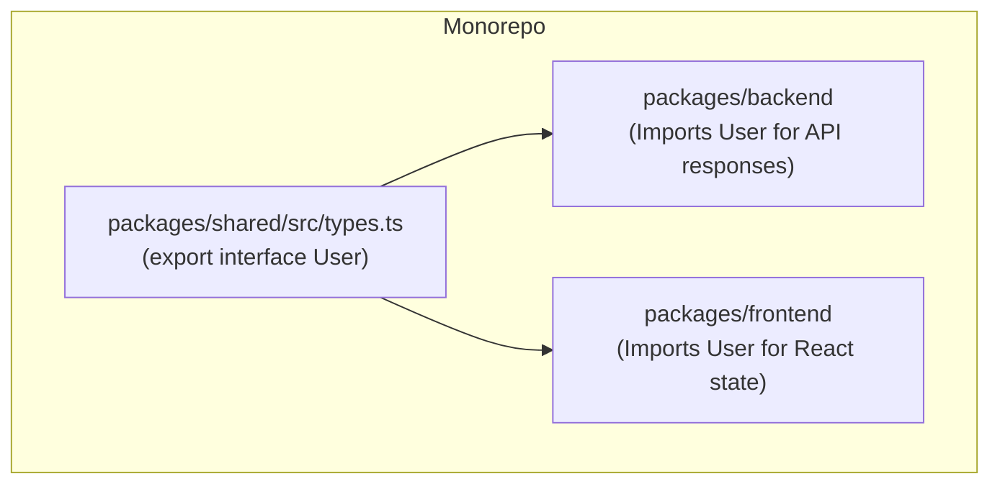

## TL;DR

One of the greatest benefits of using Node.js with TypeScript is the ability to share the exact same Types and Interfaces between your backend server and your frontend application. If you change a database model on the backend, the frontend will immediately throw compile errors if it doesn't update its UI to match.

## Mental Model



## How It Works

There are three main strategies for sharing types across the stack:

1.  **Monorepo Shared Package**: You create a workspace (using NPM Workspaces, Turborepo, or Nx) and put all your API Request/Response DTOs (Data Transfer Objects) in a standalone package. Both the frontend and backend import this package.
2.  **Code Generation from OpenAPI (Swagger)**: The backend generates an OpenAPI JSON specification. You use a tool like `openapi-typescript` on the frontend to automatically generate TS types based on that JSON. (Best for polyglot environments where the backend might not be Node.js).
3.  **tRPC**: The modern standard for full-stack TypeScript. The frontend directly imports the type signatures of the backend router.

## Example (Monorepo Approach)

```typescript
// --- shared/src/index.ts ---
// This file is published/linked internally
export interface GetUserResponse {
    id: string;
    email: string;
    isActive: boolean;
}


// --- backend/src/controller.ts ---
import { GetUserResponse } from "@my-app/shared";

app.get('/users/:id', (req, res) => {
    // Backend guarantees it responds with the exact shape
    const response: GetUserResponse = db.getUser(req.params.id);
    res.json(response);
});


// --- frontend/src/Profile.tsx ---
import { GetUserResponse } from "@my-app/shared";

async function fetchUser() {
    const res = await fetch('/users/123');
    // Frontend safely casts the response knowing the backend enforces it
    const data = (await res.json()) as GetUserResponse; 
    console.log(data.email);
}
```

## Common Interview Questions

### What is tRPC and why is it replacing standard REST in TS stacks?
tRPC allows you to write functions on your backend and call them directly from your frontend as if they were local functions, with full autocomplete and type safety, *without* needing to write a shared package or generate OpenAPI schemas. It works by having the frontend import the inferred type of the entire backend router (using `import type`).

### Should I share Database Entities (like TypeORM/Prisma models) directly with the frontend?
**No.** Database models often contain sensitive fields (passwords, internal IDs) or relational metadata. You should map your Database Entities to specific API DTOs (Data Transfer Objects), and share only the DTOs with the frontend.
