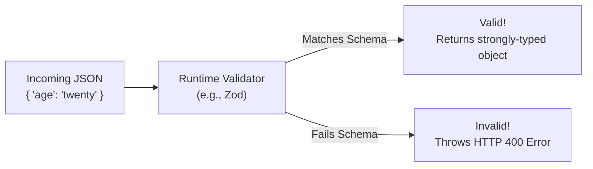

## TL;DR

Because TypeScript is erased at compile time, you must validate all data crossing the boundary of your application (API requests, file uploads, database reads) using JavaScript at runtime. If you don't, users can send payloads that crash your server or corrupt your database.

## Mental Model



## How It Works

Historically, developers wrote massive `if/else` chains (`if (typeof req.body.age !== 'number') return res.status(400)`). 
Today, we use schema validation libraries. 

A schema defines the exact shape, constraints (e.g., min length, positive numbers, regex patterns), and types of the expected data. When data enters the system, it is passed through the `.parse()` or `.validate()` method of the schema.

## Example (Without Zod / Manual Validation)

```typescript
// The Type (Erased at runtime)
interface CreatePost {
    title: string;
    content?: string;
}

// The manual Runtime Type Guard
function isCreatePost(body: any): body is CreatePost {
    if (typeof body !== 'object' || body === null) return false;
    if (typeof body.title !== 'string') return false;
    if (body.content !== undefined && typeof body.content !== 'string') return false;
    return true;
}

app.post('/posts', (req, res) => {
    // 1. RUNTIME CHECK
    if (!isCreatePost(req.body)) {
        return res.status(400).send("Invalid Payload");
    }

    // 2. COMPILE-TIME SAFETY
    // Because of the 'is' type guard above, TS now knows req.body is CreatePost!
    savePost(req.body.title, req.body.content);
});
```

## Common Interview Questions

### What happens if I just use `as` (Type Assertion) instead of Runtime Validation?
You create a massive security and stability vulnerability. If you `const user = req.body as User`, and the user sent malicious data (e.g., a massive array instead of a string to cause an Out of Memory crash, or an object designed for Prototype Pollution), your server will likely crash or process the attack successfully because it blindly trusted the type assertion.

### Where should runtime validation occur in a backend architecture?
At the absolute "edges" of your system. 
1. **Controllers / API Routes**: Validate incoming requests immediately.
2. **Database boundaries**: If reading from a loose NoSQL database or a third-party external API, validate the response before processing it. Once the data passes the edge validator, the rest of your internal core logic can safely trust the TypeScript types.
