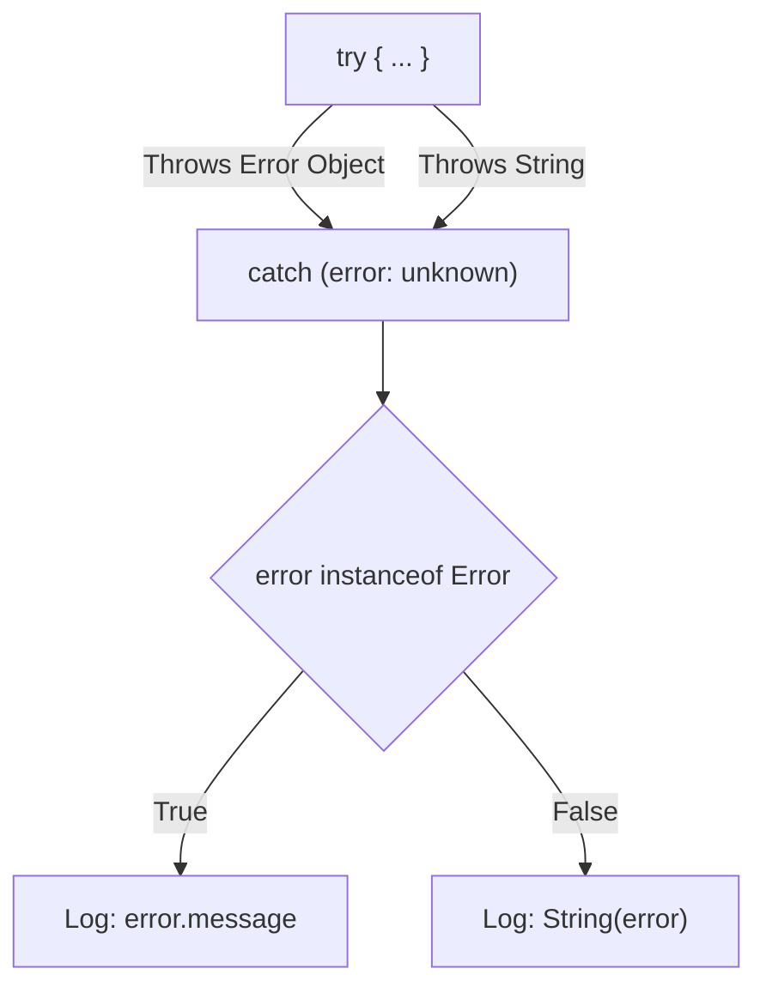

## TL;DR

In TypeScript, caught errors in a `try/catch` block are strictly typed as `unknown` (or `any`). You cannot type them as `Error` directly in the `catch` clause because JavaScript allows developers to throw literally anything (strings, numbers, objects). You must narrow the error type before accessing properties like `.message`.

## Mental Model



## How It Works

Before TS 4.4, caught errors defaulted to `any`, which let developers write `console.log(err.message)` safely, but it would crash if someone threw a string (`throw "Database failed"`). 
Now, with `"useUnknownInCatchVariables": true` (default in strict mode), the error is `unknown`.

You must use a Type Guard (`instanceof Error`) to safely access `.message` or `.stack`.

## Example

```typescript
// --- A custom App Error class ---
class DatabaseError extends Error {
    constructor(public query: string, message: string) {
        super(message);
        this.name = "DatabaseError";
    }
}

async function fetchUser() {
    try {
        await db.query("SELECT * FROM users");
    } catch (error: unknown) { // 'error' is unknown!
        
        // ERROR: Object is of type 'unknown'.
        // console.log(error.message); 

        // 1. Narrow to our specific Custom Error
        if (error instanceof DatabaseError) {
            console.error(`DB Failed on query: ${error.query}`);
            return;
        }

        // 2. Narrow to standard JS Error
        if (error instanceof Error) {
            console.error(`Standard Error: ${error.message}`);
            return;
        }

        // 3. Handle weird edge cases (someone threw a string or primitive)
        console.error(`Unknown Error occurred: ${String(error)}`);
    }
}
```

## Common Interview Questions

### Can I declare the type of the error in the catch block?
No. Writing `catch (error: DatabaseError)` is an invalid TypeScript syntax. The catch block catches *all* errors, and the compiler cannot guarantee that the code inside the `try` block won't throw a completely different type of error (like an OutOfMemory or TypeError). Therefore, it forces you to catch `unknown` and check it.

### What is the "Result Pattern" (or Either Monad)?
Because `try/catch` obscures types, many TS developers prefer returning errors as values instead of throwing them (similar to Go or Rust).
```typescript
type Result<T, E> = { success: true; data: T } | { success: false; error: E };

function safeDivide(a: number, b: number): Result<number, string> {
    if (b === 0) return { success: false, error: "Cannot divide by zero" };
    return { success: true, data: a / b };
}
```
This forces the caller to explicitly handle the error with full type safety.
