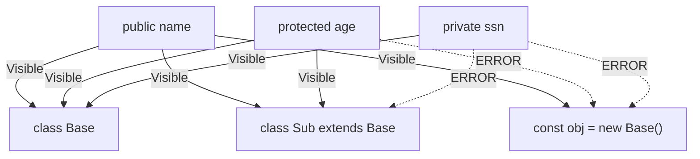

## TL;DR

TypeScript introduces three **Access Modifiers** that don't exist in traditional JavaScript:
- `public` (default): Accessible from anywhere.
- `private`: Accessible **only** within the class that defines it.
- `protected`: Accessible within the class that defines it, and any classes that inherit from it (subclasses).

## Mental Model



## How It Works

These modifiers help enforce encapsulation, ensuring that internal state cannot be accidentally modified from the outside. 

It is crucial to understand that these modifiers exist **only at compile time**. Once the code is compiled to JavaScript, the modifiers are completely erased. 

## Example

```typescript
class BankAccount {
    public accountName: string;
    private balance: number;

    constructor(name: string, initialBalance: number) {
        this.accountName = name;
        this.balance = initialBalance;
    }

    public deposit(amount: number) {
        this.balance += amount;
    }

    protected getBalance() {
        return this.balance;
    }
}

class SavingsAccount extends BankAccount {
    public printStatus() {
        // Valid: getBalance is protected, so subclasses can access it.
        console.log("Balance: ", this.getBalance());
        
        // ERROR: Property 'balance' is private and only accessible within class 'BankAccount'.
        // console.log(this.balance); 
    }
}

const myAccount = new BankAccount("Alice", 100);
console.log(myAccount.accountName); // Valid (public)
// console.log(myAccount.balance);  // ERROR (private)
```

## Common Interview Questions

### If TypeScript erases `private` at runtime, how do you make a property truly private in JavaScript?
Before ES2022, developers used WeakMaps or Closures to simulate true privacy. Now, JavaScript natively supports truly private class fields using the `#` prefix (e.g., `#balance: number;`). Unlike TypeScript's `private` keyword, fields marked with `#` are strictly enforced at runtime by the JS engine and cannot be accessed even with sneaky hacks.

### When should I use `private` vs `#`?
Use TS `private` if you want soft encapsulation (type-checking only). Use JS `#` if you need hard runtime security (e.g., storing a highly sensitive cryptographic key in memory). Note that TS supports both simultaneously!
