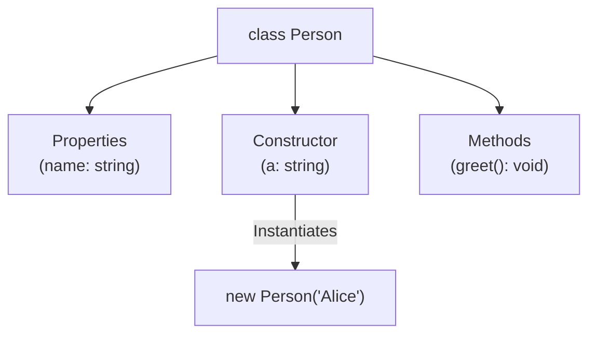

## TL;DR

TypeScript enhances ES6 Classes by allowing you to add strict types to instance properties, constructor arguments, and methods. It also introduces features that don't exist in JavaScript natively, like Access Modifiers (`public`, `private`), Abstract Classes, and Interfaces for classes.

## Mental Model



## How It Works

In standard JavaScript, you can just create properties inside the constructor using `this.name = ...`.
In TypeScript, you **must declare** the properties on the class body before you can assign them in the constructor, unless you use Parameter Properties (a TS shortcut).

## Example

```typescript
class Greeter {
    // 1. Property Declarations
    greeting: string;
    readonly version: number = 1.0; // Cannot be changed after initialization

    // 2. Constructor
    constructor(message: string) {
        this.greeting = message;
    }

    // 3. Method
    greet() {
        return "Hello, " + this.greeting;
    }
}

let greeter = new Greeter("world");
console.log(greeter.greet());


// --- THE SHORTCUT: Parameter Properties ---
class FastGreeter {
    // By adding 'public', 'private', or 'readonly' to the constructor argument,
    // TS automatically declares the property AND assigns it for you!
    constructor(public greeting: string) {}
}
```

## Common Interview Questions

### What happens if you don't initialize a property in the constructor?
If you declare a property like `name: string;` but forget to assign it in the constructor, TypeScript will throw an error (if `strictPropertyInitialization` is turned on in `tsconfig`). If you are absolutely sure it will be initialized later (e.g., by an ORM or dependency injection), you can use the **Definite Assignment Assertion** (`!`) like so: `name!: string;`.

### Does a TypeScript class create a Type or a Value?
**Both!** This is unique to classes. When you write `class Point {}`, it creates a runtime *value* (the constructor function that you can call with `new`) AND a compile-time *type* (representing the shape of instances of the class).
