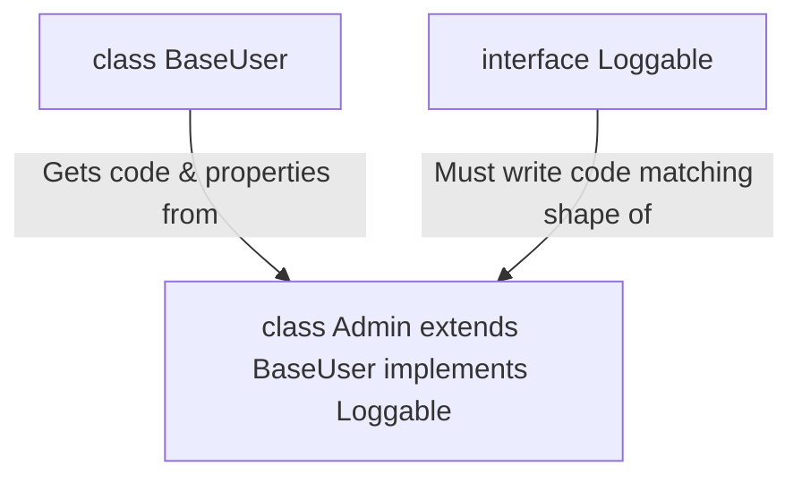

## TL;DR

- **`extends`** (Inheritance): A class copies all properties and methods from a base class. It establishes an "Is-A" relationship.
- **`implements`** (Contract): A class agrees to adhere to the shape defined by an interface. It establishes a "Can-Do" relationship.

## Mental Model



## How It Works

### `extends`
When a class extends another class, it inherits its actual runtime code. If the base class has a `greet()` method, the child class automatically gets it without writing any new code. You can only extend **one** class at a time (JavaScript does not support multiple inheritance).

### `implements`
When a class implements an interface, it inherits absolutely no code. The interface acts as a strict checklist. The class must manually write out all the properties and methods listed in the interface. You can implement **multiple** interfaces at the same time (separated by commas).

## Example

```typescript
// --- The Class to EXTEND ---
class BaseEntity {
    id: string = Math.random().toString();
    save() { console.log("Saved to DB!"); }
}

// --- The Interfaces to IMPLEMENT ---
interface Pingable {
    ping(): void;
}
interface Loggable {
    log(msg: string): void;
}

// --- The Subclass ---
// Extends exactly 1 class, Implements N interfaces
class Server extends BaseEntity implements Pingable, Loggable {
    // We get 'id' and 'save()' for free from BaseEntity!

    // We MUST write the implementation for ping()
    ping() {
        console.log("Pong");
    }

    // We MUST write the implementation for log()
    log(msg: string) {
        console.log(`[Server ${this.id}]: ${msg}`);
    }
}
```

## Common Interview Questions

### Can an interface `extend` a class?
Surprisingly, **Yes!** In TypeScript, an interface can extend a class. When it does, it inherits all the class's property types and method signatures (including `private` and `protected` ones), but not their implementations. This is an advanced feature usually avoided because it tightly couples the interface to the class hierarchy.

### What happens if you try to `implement` an interface, but you add extra properties to the class?
That is perfectly fine. `implements` only guarantees that the *minimum* requirements of the interface are met. The class is free to add as many extra properties or methods as it wants.
