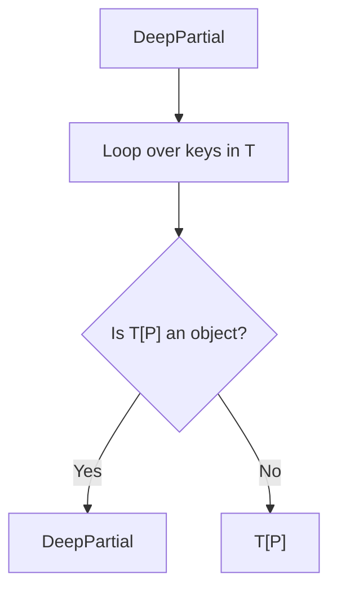

## TL;DR

The built-in `Partial<T>` utility only makes the *top-level* properties of an object optional. If you have nested objects, they remain required. To solve this, you must write a **Recursive Mapped Type**.

## Mental Model



## The Challenge

You are given a highly nested configuration object.
```typescript
interface AppConfig {
    port: number;
    db: {
        host: string;
        user: string;
    };
}
```
If you use standard `Partial<AppConfig>`, `db` becomes optional, but if you *do* provide `db`, you must provide both `host` and `user`. Write a type that allows providing just `db: { host: "localhost" }`.

## The Solution

```typescript
type DeepPartial<T> = T extends Function
    ? T // Functions don't need partialing
    : T extends Array<infer U>
    ? _DeepPartialArray<U> // Handle arrays specifically (optional)
    : T extends object
    ? {
          // The magic: Mapped Type + Recursive Call
          [P in keyof T]?: DeepPartial<T[P]>;
      }
    : T | undefined; // Base case for primitives

// Helper for arrays
type _DeepPartialArray<T> = Array<DeepPartial<T>>;

// --- USAGE ---
const myConfig: DeepPartial<AppConfig> = {
    db: {
        host: "localhost" 
        // Valid! 'user' is now optional inside the nested 'db' object.
    }
};
```

## Common Interview Questions

### Why do we need `T extends Function ? T` at the beginning?
In JavaScript, functions are technically objects (`typeof () => {} === "object"`). If we don't exclude them first, the mapped type `{ [P in keyof T]?: ... }` will try to iterate over the internal methods of the Function prototype (like `.bind`, `.call`), destroying the function signature and replacing it with an empty object type.

### How does this handle Arrays?
Arrays are also objects. If you just map over an array using `[P in keyof T]`, it maps over array properties like `length` and `push`, turning the array into a weird dictionary object. We must catch Arrays explicitly (`T extends Array<infer U>`) and recursively call `DeepPartial` only on the array's *elements*, returning a proper `Array` type.
