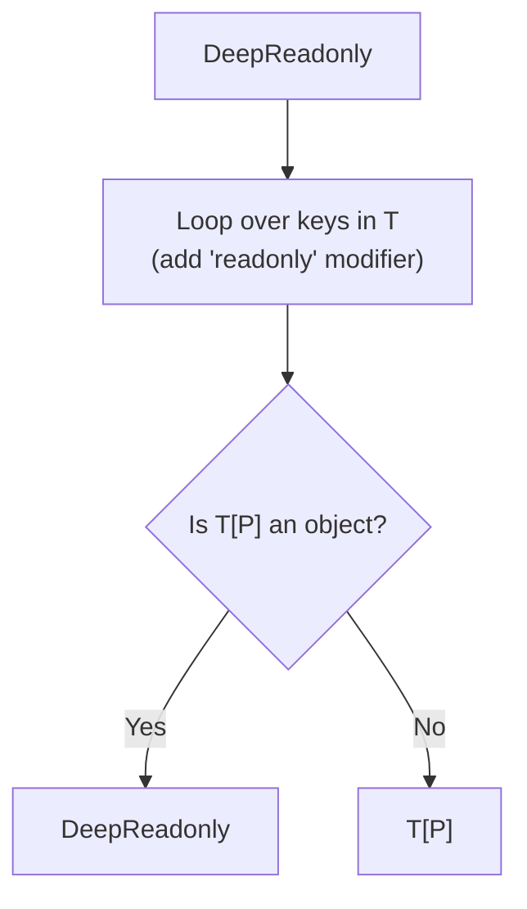

## TL;DR

The built-in `Readonly<T>` utility only adds the `readonly` modifier to the *top-level* properties of an object. If you have nested objects or arrays, their internal properties can still be mutated. To prevent this, you must write a **Recursive Mapped Type**.

## Mental Model



## The Challenge

You are given a deeply nested Redux state object.
```typescript
interface State {
    user: {
        preferences: {
            theme: string;
        }
    };
    logs: string[];
}
```
If you use standard `Readonly<State>`, `state.user = newObj` is blocked, but `state.user.preferences.theme = 'dark'` is perfectly allowed! Write a type that blocks ALL mutations deeply.

## The Solution

```typescript
type DeepReadonly<T> = T extends Function
    ? T // Functions are already immutable by nature
    : T extends Array<infer U>
    ? ReadonlyArray<DeepReadonly<U>> // Make the array itself readonly, AND its contents
    : T extends object
    ? {
          // The magic: Mapped Type with 'readonly' + Recursive Call
          readonly [P in keyof T]: DeepReadonly<T[P]>;
      }
    : T; // Base case for primitives (strings, numbers)

// --- USAGE ---
declare const state: DeepReadonly<State>;

// ERROR: Cannot assign to 'user' because it is a read-only property.
// state.user = { preferences: { theme: 'dark' } };

// ERROR: Cannot assign to 'theme' because it is a read-only property.
// state.user.preferences.theme = "dark";

// ERROR: Property 'push' does not exist on type 'readonly string[]'.
// state.logs.push("Error!");
```

## Common Interview Questions

### What does `ReadonlyArray<T>` do?
It is a built-in TypeScript type (also written as `readonly T[]`) that removes all mutating methods from an array (like `push()`, `pop()`, `splice()`), and prevents assignment to indices (`arr[0] = 1`). It is the array equivalent of the `readonly` property modifier.

### Does `DeepReadonly` affect the compiled JavaScript?
Absolutely not. Like all TypeScript types, it is completely erased at compile time. It only stops developers from writing mutating code in their IDE. If you want to freeze an object at runtime so that even JS cannot mutate it, you must use `Object.freeze()` (but note that `Object.freeze` is *also* shallow by default and requires a recursive JS function to be truly deep!).
