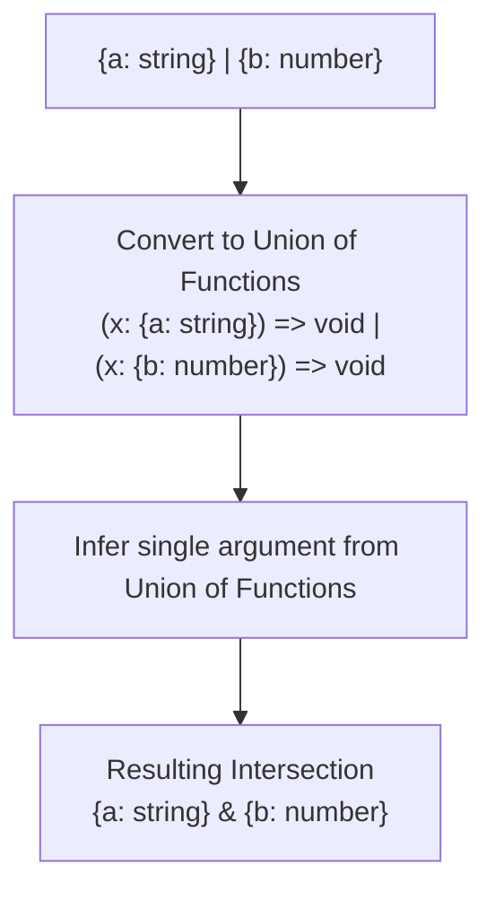

## TL;DR

Converting a Union (`A | B`) to an Intersection (`A & B`) is one of the most notoriously difficult type challenges. It requires exploiting a specific, obscure quirk in how TypeScript infers types from **Function Arguments** (Contravariance).

## Mental Model



## The Challenge

You are given a union of objects: `type U = { a: string } | { b: number }`.
Write a type `UnionToIntersection<U>` that outputs `{ a: string } & { b: number }`.

This is useful when you have an array of plugins or mixins, and you want to generate a single type that represents the fully merged application.

## The Solution

```typescript
type UnionToIntersection<U> = 
    // Step 1: Distribute the union into a union of functions.
    // U extends any ? (k: U) => void : never
    // If U is (A | B), this creates: ((k: A) => void) | ((k: B) => void)
    (U extends any ? (k: U) => void : never) extends 
    
    // Step 2: Use 'infer' on the function argument.
    // Because the functions are in a contravariant position (they are arguments),
    // TS infers an intersection of all possible arguments!
    ((k: infer I) => void) 
        ? I 
        : never;

// --- USAGE ---
type Merged = UnionToIntersection<{ a: string } | { b: number }>;
// Evaluates to: { a: string } & { b: number }

const result: Merged = {
    a: "hello",
    b: 42
};
```

## Common Interview Questions

### Why does inferring a function argument create an intersection?
This relates to **Variance** (Covariance vs Contravariance). 
- If you infer the *return type* of a union of functions, TS returns a Union (Covariant). If a function returns A or returns B, the result is A | B.
- If you infer the *argument type* of a union of functions, TS returns an Intersection (Contravariant). If a function must be able to accept A, AND another function must be able to accept B, the only way a single unified function can safely execute both logic paths is if the argument provides *both* A and B. Thus, TS infers `A & B`.

### Should I memorize this?
Unless you are interviewing for a library author position at a company like Vercel or building a highly complex generic library, no. However, understanding *why* it works demonstrates a profound mastery of the compiler's inference engine.
