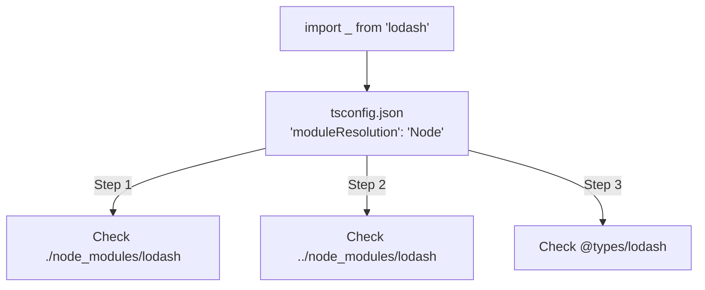

## TL;DR

**Module Resolution** is the algorithm the TypeScript compiler uses to figure out what file `import { X } from "module"` refers to. Because TypeScript supports both Node.js (CommonJS) and modern bundlers (ESM), configuring this algorithm correctly is crucial to prevent "Cannot find module" errors.

## Mental Model



## How It Works

Controlled via the `"moduleResolution"` option in `tsconfig.json`.

Historically, the standard was `"Node"`. This perfectly mimicked Node's behavior: it looked in the local `node_modules`, then traversed up the directory tree looking for `package.json` files and `.d.ts` files.

Recently, with the rise of ECMAScript Modules (ESM) in Node.js and the browser, new strategies have emerged:
- `"NodeNext"` or `"Node16"`: The modern standard for Node.js. It requires explicit file extensions in relative imports (`import { a } from "./math.js"`) and respects the `exports` field in `package.json`.
- `"Bundler"`: The modern standard if you are using Vite, Webpack, or esbuild. It resolves imports the way modern bundlers do (allowing extensionless imports) but outputs modern ESM syntax.

## Example

```json
{
  "compilerOptions": {
    // If you are writing a backend app in modern Node.js:
    "module": "NodeNext",
    "moduleResolution": "NodeNext",
    
    // If you are writing a React app using Vite:
    "module": "ESNext",
    "moduleResolution": "Bundler",
    
    // Path Aliases (Absolute Imports)
    // Often configured alongside module resolution!
    "baseUrl": ".",
    "paths": {
      "@components/*": ["src/components/*"],
      "@utils/*": ["src/utils/*"]
    }
  }
}
```

## Common Interview Questions

### What do the `baseUrl` and `paths` options do?
They allow you to create **Path Aliases**. Instead of writing messy relative imports like `import { Button } from "../../../components/Button"`, you can configure paths to allow clean absolute imports: `import { Button } from "@components/Button"`. Note that TypeScript *only* resolves these during compilation; your runtime bundler (like Webpack or tsconfig-paths) must also be configured to understand them!

### Why do I get a "Cannot find module" error if the file exists?
1. The file might not be included in the `include` array in `tsconfig.json`.
2. You might be using `"moduleResolution": "NodeNext"` but forgot to include the `.js` extension in your import statement (Node ESM requires explicit extensions).
