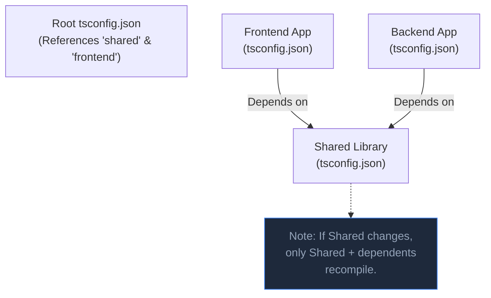

## TL;DR

**Project References** allow you to split a massive TypeScript codebase into smaller, independent "projects." Instead of the compiler checking the entire codebase every time a single file changes, it only compiles the specific sub-project that changed and its dependents. This drastically improves compile times in Monorepos.

## Mental Model



## How It Works

Normally, `tsc` loads all files into memory. For huge codebases, this can take minutes and cause OOM (Out of Memory) crashes.

With Project References:
1. You create a separate `tsconfig.json` for each workspace package.
2. In the dependent packages, you add a `"references"` array pointing to the paths of the packages they depend on.
3. You must enable `"composite": true` in the referenced projects. This tells TS to generate `.d.ts` files and an internal `.tsbuildinfo` cache file.

When you run `tsc --build` (or `tsc -b`), TypeScript acts like a build tool (like Make). It checks the cache and only rebuilds what is necessary.

## Example

**1. The Shared Library (The Dependency)**
```json
// packages/shared/tsconfig.json
{
  "compilerOptions": {
    "composite": true,       // CRITICAL: Marks this as a referenceable project
    "declaration": true,     // Must generate .d.ts files
    "outDir": "./dist"
  },
  "include": ["src/**/*"]
}
```

**2. The Frontend App (The Dependent)**
```json
// packages/frontend/tsconfig.json
{
  "compilerOptions": {
    "outDir": "./dist"
  },
  "references": [
    // CRITICAL: Points to the shared project!
    { "path": "../shared" }
  ]
}
```

## Common Interview Questions

### What does the `.tsbuildinfo` file do?
When `"composite": true` is enabled, TypeScript generates a `.tsbuildinfo` file alongside the compiled output. This file contains a massive JSON snapshot of the project's dependency graph and file signatures. On the next compile, TS reads this file to instantly know which files haven't changed, allowing it to skip them entirely (Incremental Builds).

### Do I need Project References if I use Turborepo or Nx?
Turborepo and Nx are task runners that cache the *output* of commands. However, they don't change how `tsc` works internally. For maximum performance in a Monorepo, you use Turborepo to orchestrate the tasks, AND you use Project References to make the actual `tsc` type-checking as fast as possible.
