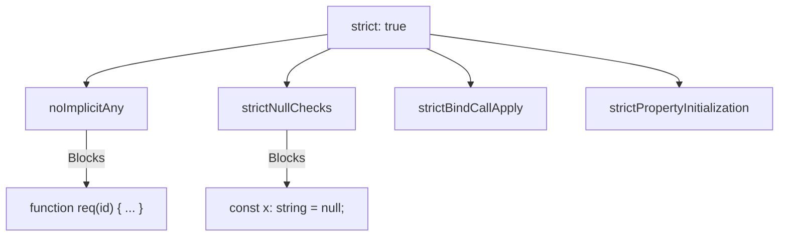

## TL;DR

`"strict": true` in `tsconfig.json` is a master switch that simultaneously enables several rigorous type-checking rules. Running TypeScript without strict mode is often considered worse than writing plain JavaScript because it gives a false sense of security.

## Mental Model



## How It Works

When you enable `"strict": true`, you are enabling these critical rules:

1.  **`noImplicitAny`**: If TS cannot figure out the type of a variable or parameter, it defaults to `any`. This flag throws an error if that happens, forcing you to write an explicit type.
2.  **`strictNullChecks`**: In non-strict mode, `null` and `undefined` can be assigned to *any* type (like `string` or `number`). This flag fixes that "billion-dollar mistake", ensuring `null` is its own type and forcing you to check for it.
3.  **`strictPropertyInitialization`**: Forces you to initialize all class properties in the constructor.
4.  **`strictBindCallApply`**: Ensures that `fn.call()` and `fn.apply()` are used with the correct arguments.

## Example

```typescript
// --- WITHOUT STRICT MODE ---
function logUser(user) { // user is implicitly 'any'
    console.log(user.name);
}
let username: string = null; // Perfectly fine in non-strict mode!


// --- WITH STRICT MODE ENABLED ---
// ERROR: Parameter 'user' implicitly has an 'any' type.
// function logUserStrict(user) { ... } 

// CORRECT:
function logUserStrict(user: { name: string }) {
    console.log(user.name);
}

// ERROR: Type 'null' is not assignable to type 'string'.
// let usernameStrict: string = null; 

// CORRECT:
let usernameStrict: string | null = null;
if (usernameStrict !== null) {
    console.log(usernameStrict.toUpperCase());
}
```

## Common Interview Questions

### Should I use strict mode on a new project?
**Always.** There is zero debate in the TS community about this. Starting a new project without strict mode defeats the entire purpose of using TypeScript.

### How do I enable strict mode on an existing, massive legacy JavaScript codebase?
You shouldn't enable `"strict": true` immediately, as you will get thousands of errors. Instead:
1. Enable `strict` in the config.
2. Manually set all the sub-flags (like `noImplicitAny` and `strictNullChecks`) to `false`.
3. Gradually turn the sub-flags to `true` one by one, fixing the errors across the codebase incrementally.
