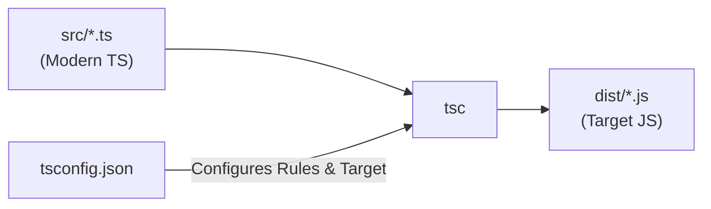

## TL;DR

The `tsconfig.json` file is the brain of a TypeScript project. It tells the TypeScript compiler (`tsc`) which files to compile, what version of JavaScript to output, how strict the type checking should be, and how to resolve imports. 

## Mental Model



## How It Works

A `tsconfig.json` is split into two main areas:
1. **File Inclusion/Exclusion**: (`include`, `exclude`, `files`) Determines exactly which `.ts` files the compiler should look at.
2. **CompilerOptions**: The massive object that controls the behavior of the compiler itself.

### Key `compilerOptions`
- `target`: Which version of JavaScript to output (e.g., `ES2015`, `ESNext`).
- `module`: Which module system to output (e.g., `CommonJS` for Node, `ESNext` for bundlers).
- `lib`: Which built-in types to include (e.g., `["DOM"]` if writing React, remove it if writing Node.js).
- `outDir`: Where to put the compiled `.js` files.
- `strict`: Enables a suite of rigorous type-checking rules.

## Example

```json
{
  "compilerOptions": {
    /* Basic Options */
    "target": "es2022",           // Output modern JS
    "module": "commonjs",         // Format for Node.js
    "outDir": "./dist",           // Put compiled files here
    "rootDir": "./src",           // Only compile files inside src/
    
    /* Strict Type-Checking */
    "strict": true,               // Enable all strict checks
    "noImplicitAny": true,        // Forbid variables from silently becoming 'any'
    
    /* Module Resolution */
    "esModuleInterop": true,      // Allows 'import x from "lodash"' instead of '* as'
    "skipLibCheck": true,         // Skips checking .d.ts files in node_modules (faster builds!)
    "forceConsistentCasingInFileNames": true
  },
  "include": ["src/**/*"],        // Compile everything in src
  "exclude": ["node_modules", "**/*.test.ts"] // Ignore tests and modules
}
```

## Common Interview Questions

### What does `skipLibCheck` do and why is it usually true?
By default, TypeScript checks the types of every single file in your project, *including* the thousands of `.d.ts` files inside `node_modules`. This is incredibly slow and often throws errors for libraries you don't even own. `skipLibCheck: true` tells TS to skip checking those files, massively improving compilation speed.

### Can a `tsconfig.json` inherit from another config?
Yes! Using the `"extends"` property, you can inherit base configurations. This is heavily used in Monorepos (where a base `tsconfig.base.json` at the root is extended by the frontend and backend packages) or by using official community presets like `"extends": "@tsconfig/node18/tsconfig.json"`.
