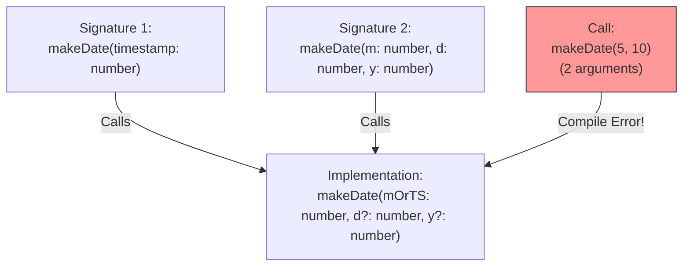

## TL;DR

**Function Overloads** allow you to define multiple, different ways a function can be called. You write several "signatures" without a body, followed by one single "implementation" that actually handles the logic for all the signatures.

## Mental Model



## How It Works

JavaScript doesn't support true method overloading (like Java or C# where you write multiple functions with the same name). In JS, the last function defined overwrites the previous ones. 

TypeScript simulates overloading:
1. You write the **Overload Signatures** (what the user of the function sees).
2. You write the **Implementation Signature** (which must be broad enough to encompass all overloads).
*Note: The implementation signature is invisible from the outside. You can only call the function using the specific overload signatures.*

## Example

```typescript
// 1. Overload Signature 1 (Takes 1 argument)
function makeDate(timestamp: number): Date;

// 2. Overload Signature 2 (Takes 3 arguments)
function makeDate(m: number, d: number, y: number): Date;

// 3. The Implementation (Must handle both 1 argument and 3 arguments)
function makeDate(mOrTimestamp: number, d?: number, y?: number): Date {
    if (d !== undefined && y !== undefined) {
        // It was called with 3 arguments
        return new Date(y, mOrTimestamp, d);
    } else {
        // It was called with 1 argument
        return new Date(mOrTimestamp);
    }
}

const d1 = makeDate(12345678);        // OK
const d2 = makeDate(5, 5, 2024);      // OK
// const d3 = makeDate(5, 9);         // ERROR: No overload expects exactly 2 arguments!
```

## Common Interview Questions

### Should you use Overloads or Union Types?
**Always prefer Union Types if possible.** If a function just takes a string or an array of strings, use `(input: string | string[])`. You only need overloads when the *return type* changes based on the input type, or when the *number of arguments* completely changes the meaning of the function (like the Date example).

### Does the Implementation Signature get exported?
No. If you write a library and export an overloaded function, developers using your library will only see the Overload Signatures in their IDE autocomplete. The Implementation Signature is purely internal.
