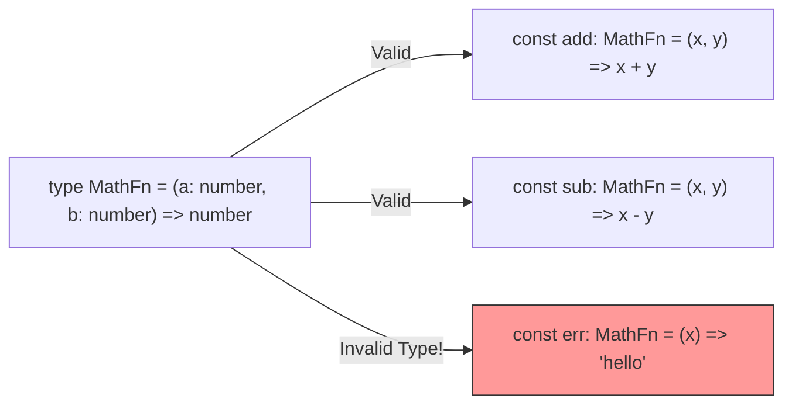

## TL;DR

In TypeScript, you can type a function's parameters and its return value. You can also define the **type of the function itself**, allowing you to pass functions as callbacks safely.

## Mental Model



## How It Works

There are a few ways to declare function types:
1.  **Inline**: `function greet(name: string): string { ... }`
2.  **Type Alias (Arrow Syntax)**: `type Greet = (name: string) => string;`
3.  **Call Signature (Object Syntax)**: `type Greet = { (name: string): string; }` (Used if the function also has properties attached to it).

You can also have optional parameters (using `?`) and default parameters, just like standard JavaScript.

## Example

```typescript
// 1. Defining a function type alias
type SearchCallback = (query: string, limit?: number) => boolean;

// 2. Using the alias on a variable
// Notice we don't need to type `q` or `l` here, TS infers them from SearchCallback!
const mySearch: SearchCallback = (q, l) => {
    return q.length > 3;
};

// 3. Passing a typed callback into a function
function executeSearch(keyword: string, callback: SearchCallback) {
    const success = callback(keyword, 10);
    console.log(success ? "Found it!" : "Keep looking.");
}
```

## Common Interview Questions

### Why does TypeScript allow passing fewer arguments to a callback?
If `type Callback = (a: number, b: number) => void`, you might expect TS to throw an error if you pass `(a) => console.log(a)`. But TS allows it! This is a specific design choice to mirror how JavaScript handles arrays. `[1, 2].forEach(item => console.log(item))` is valid, even though `forEach` actually provides 3 arguments (item, index, array). If TS enforced all arguments, `forEach` would be unusable.

### How do you type Rest Parameters?
Use the standard spread syntax and type it as an array.
`function sum(first: number, ...restOfNumbers: number[]) { ... }`
