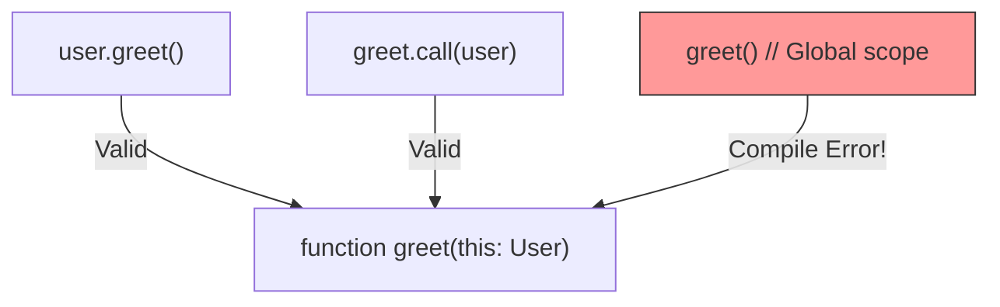

## TL;DR

In JavaScript, the value of the `this` keyword is determined by *how* a function is called, which often leads to runtime bugs. TypeScript allows you to explicitly type the `this` keyword by declaring it as the **first fake parameter** of a function.

## Mental Model



## How It Works

If you have a loose function (not an arrow function, and not a class method) that relies on the `this` context, TypeScript will implicitly give `this` the type of `any`, which is dangerous.

By providing a type for `this` as the very first argument, TypeScript will erase it from the compiled JavaScript, but will enforce at compile-time that the function is only called from an object that matches the type.

## Example

```typescript
interface User {
    id: number;
    isAdmin: boolean;
}

// 1. Declare 'this' as the first parameter
function checkAccess(this: User, resourceName: string) {
    if (this.isAdmin) {
        console.log(`Access granted to ${resourceName} for User ${this.id}`);
    } else {
        console.log("Access denied.");
    }
}

// 2. Usage
const admin: User = { id: 1, isAdmin: true };
const guest = { name: "Guest" };

// Valid: Using .call() to pass the correct context
checkAccess.call(admin, "Dashboard");

// ERROR: The 'this' context of type '{ name: string; }' is not assignable to method's 'this' of type 'User'.
// checkAccess.call(guest, "Dashboard"); 
```

## Common Interview Questions

### Can you use the `this` parameter in Arrow Functions?
No. Arrow functions do not have their own `this` binding; they inherit `this` from the lexical scope where they were defined. If you try to type `this` in an arrow function, TypeScript will throw an error.

### What happens to the `this` parameter in the compiled JavaScript?
It is completely erased. The first *real* parameter becomes the first argument at runtime. In the example above, `resourceName` is actually the first argument at runtime.
