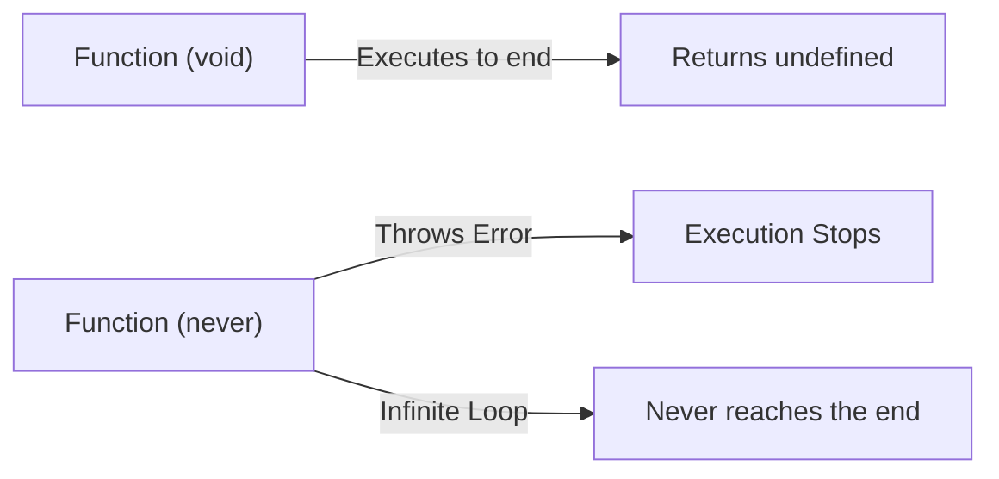

## TL;DR

- **`void`**: Used when a function successfully finishes executing but does not return a value (it implicitly returns `undefined`).
- **`never`**: Used when a function **never** successfully finishes executing. It either crashes (throws an error) or runs in an infinite loop.

## Mental Model



## How It Works

### `void`
This is the standard return type for side-effect functions, like `console.log` wrappers or DOM manipulation functions. Even though you don't write `return`, JavaScript engines implicitly return `undefined`.

### `never`
This represents a state that shouldn't exist. It is the "bottom type" in TypeScript. Because a `never` function never returns, TypeScript knows that any code written *after* a call to a `never` function is unreachable.

## Example

```typescript
// --- VOID ---
// This function finishes successfully, but returns nothing.
function logMessage(msg: string): void {
    console.log(msg);
}

// --- NEVER ---
// This function throws an error, interrupting the flow. It never returns.
function throwError(errorMsg: string): never {
    throw new Error(errorMsg);
}

// This function loops forever. It never returns.
function keepRunning(): never {
    while (true) {
        console.log("Running...");
    }
}
```

## Common Interview Questions

### Can you assign a value to a variable of type `never`?
No. You cannot assign *anything* to `never` (not even `any`). However, you can assign `never` to any other type. This makes it incredibly useful for **Exhaustive Checking** in switch statements (ensuring you handled all possible union types).

### If a function returns `undefined`, should its type be `void` or `undefined`?
If the function doesn't have a `return` statement, it should be `void`. If the function explicitly has `return undefined;`, its type can be `undefined`. Generally, `void` is preferred for callbacks and functions meant to be executed for side effects.
