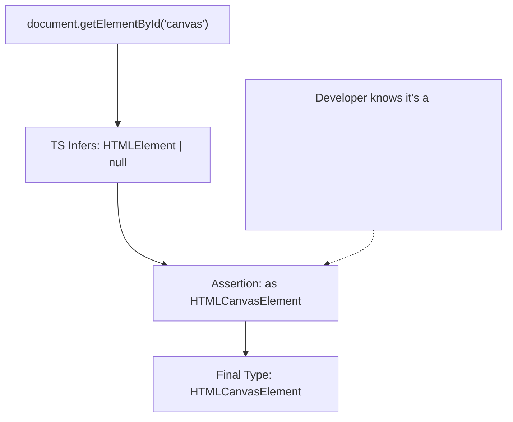

## TL;DR

A **Type Assertion** (using the `as` keyword) tells the TypeScript compiler: *"Trust me, I know exactly what type this variable is, stop complaining."* It performs no runtime checks; it is purely a compile-time override.

## Mental Model



## How It Works

Sometimes you have information about a value that TypeScript can't possibly know. The most common scenario is fetching elements from the DOM or parsing raw JSON data.

You use the `value as Type` syntax. (There is also an older `<Type>value` syntax, but it clashes with React JSX, so `as` is preferred).

*Warning: Assertions are dangerous. If you assert incorrectly, TypeScript will compile without errors, but your code will crash at runtime.*

## Example

```typescript
// Scenario: We have a canvas element in our index.html
// TS only knows this returns a generic HTMLElement (or null).
const element = document.getElementById("myCanvas");

// ERROR: Property 'getContext' does not exist on type 'HTMLElement'.
// element.getContext("2d"); 

// --- SOLUTION: Type Assertion ---
const canvas = document.getElementById("myCanvas") as HTMLCanvasElement;

// Now TS allows this, because it trusts you that it's a Canvas element.
const ctx = canvas.getContext("2d");
```

## Common Interview Questions

### What is the difference between Type Assertion and Type Casting?
In languages like Java or C#, "casting" actually converts the data at runtime (e.g., converting a float to an integer). In TypeScript, a Type Assertion does absolutely **nothing** at runtime. It is completely erased during compilation. It only affects the type checker.

### Can you assert any type to any other type?
No. TypeScript only allows assertions that are somewhat reasonable (from a more specific type to a less specific type, or vice versa). You cannot assert a `string` directly into a `number`. 
If you absolutely must force an impossible assertion, you have to assert to `unknown` first: `const x = "hello" as unknown as number;` (This is usually a sign of bad architecture).
